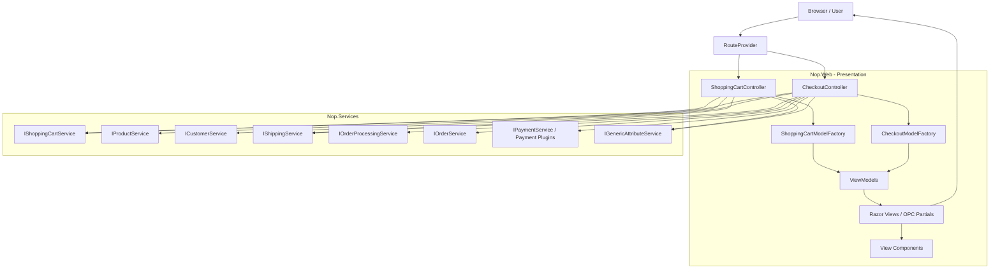
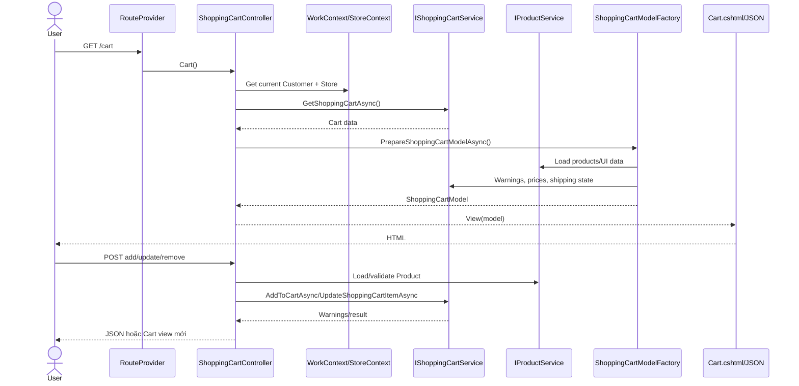
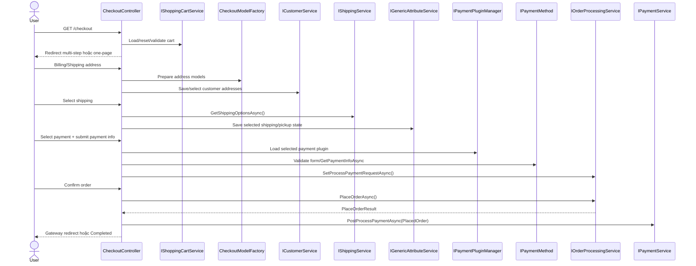

# T03 - Kiến trúc Shopping Cart và Checkout

## 1. Thông tin tài liệu

| Thuộc tính                          | Giá trị                                                                                                |
| ------------------------------------- | -------------------------------------------------------------------------------------------------------- |
| Deliverable                           | T03 -`docs/architecture.md`                                                                            |
| Source baseline                       | `674d0ceef6bd8a52fe74d6f4fff326960162cec0`                                                             |
| Trần Thị Phương Trang phụ trách | `Nop.Web`, `ShoppingCartController`, `CheckoutController`, Model Factory, ViewModel và Razor View |
| Đỗ Đặng Diệu Linh phụ trách    | `Nop.Services`, `Nop.Core` và database flow                                                         |
| Chức năng                           | Shopping Cart và Checkout storefront                                                                    |
| Ngoài phạm vi                       | Admin, Wishlist và các luồng ngoài`scope.md`                                                       |
| Trạng thái                          | In Progress - phần Nop.Web của Trang đã hoàn thành; chờ phần của Linh và review nhóm          |

## 2. Mục tiêu và kết luận chính

Mục tiêu của phần Trang là xác định request Shopping Cart và Checkout đi qua những thành phần nào ở tầng web, Controller gọi service interface nào, dữ liệu được chuyển thành ViewModel ra sao và những nhánh nào phù hợp để thiết kế test trong phạm vi đã thống nhất tại [`scope.md`](../scope.md).

Kết luận chính:

- `Nop.Web` là tầng Presentation ASP.NET Core MVC, chịu trách nhiệm routing, điều phối request, validation ở mức web và tạo response.
- `ShoppingCartController` điều phối thêm, sửa, xóa sản phẩm, coupon, ước tính shipping và chuyển sang checkout.
- `CheckoutController` hoạt động như state machine cho hai chế độ multi-step và one-page checkout.
- Model Factory tổng hợp dữ liệu từ nhiều service rồi tạo ViewModel dành riêng cho UI.
- Controller chỉ biết các service qua interface được inject; implementation của service, Core entity và database flow nằm ngoài phạm vi tài liệu này.
- Tại ranh giới Nop.Web, lệnh đặt hàng được chuyển giao qua `IOrderProcessingService.PlaceOrderAsync`.
- Sau khi service trả về `PlacedOrder` thành công, Controller chuyển sang `IPaymentService.PostProcessPaymentAsync` hoặc trang Completed.

## 3. Kiến trúc component/container

Sơ đồ chỉ thể hiện các interface service mà `Nop.Web` phụ thuộc. Cách những service này xử lý Core entity và database thuộc tài liệu của Linh.

Dependency Injection đăng ký:

- `IShoppingCartModelFactory → ShoppingCartModelFactory`.
- `ICheckoutModelFactory → CheckoutModelFactory`.

Đăng ký nằm trong [`NopStartup.cs`](../src/Presentation/Nop.Web/Infrastructure/NopStartup.cs#L77).

## 4. Các module chính và dependency

| Module                       | Vai trò                                                                          | Dependency quan trọng                                                                                                      | Output                                                       |
| ---------------------------- | --------------------------------------------------------------------------------- | --------------------------------------------------------------------------------------------------------------------------- | ------------------------------------------------------------ |
| `RouteProvider`            | Ánh xạ URL sang Controller/action                                               | ASP.NET endpoint routing,`NopRouteNames`                                                                                  | Route values                                                 |
| `ShoppingCartController`   | Điều phối add/update/remove cart, coupon, shipping estimate và start checkout | `IShoppingCartService`, `IProductService`, `IShoppingCartModelFactory`                                                | View, redirect hoặc JSON                                    |
| `ShoppingCartModelFactory` | Chuyển cart/domain data thành model hiển thị                                  | Cart, product, order total, tax, currency và payment plugin services                                                       | `ShoppingCartModel`, `OrderTotalsModel`, estimate models |
| `CheckoutController`       | Điều phối các bước checkout và lệnh đặt hàng                           | `ICheckoutModelFactory`, `IShoppingCartService`, `IOrderProcessingService`, `IPaymentService`, `IShippingService` | View, redirect hoặc JSON section                            |
| `CheckoutModelFactory`     | Chuẩn bị address, shipping, payment, confirm và completed models               | Customer, address, shipping, order total, payment và reward point services                                                 | Các`Checkout...Model`                                     |
| Razor Views/View Components  | Render form, cart summary, totals và OPC sections                                | ViewModels, route names                                                                                                     | HTML và form/AJAX request                                   |

## 5. Request routing

Các route chính được định nghĩa trong [`RouteProvider.cs`](../src/Presentation/Nop.Web/Infrastructure/RouteProvider.cs).

| HTTP/URL                                                         | Controller.action                           | Chức năng                                  |
| ---------------------------------------------------------------- | ------------------------------------------- | -------------------------------------------- |
| `GET /{lang}/cart/`                                            | `ShoppingCartController.Cart`             | Hiển thị giỏ hàng                        |
| `POST /{lang}/cart/` + `updatecart`                          | `ShoppingCartController.UpdateCart`       | Cập nhật quantity hoặc xóa item          |
| `POST /{lang}/cart/` + `checkout`                            | `ShoppingCartController.StartCheckout`    | Validate và bắt đầu checkout             |
| `POST /addproducttocart/catalog/{productId}/{type}/{quantity}` | `AddProductToCart_Catalog`                | Thêm nhanh từ catalog                      |
| `POST /addproducttocart/details/{productId}/{type}`            | `AddProductToCart_Details`                | Thêm từ trang product detail               |
| `POST /cart/estimateshipping`                                  | `GetEstimateShipping`                     | Ước tính shipping qua AJAX                |
| `GET /{lang}/checkout/`                                        | `CheckoutController.Index`                | Entry point checkout                         |
| `GET/POST /{lang}/checkout/billingaddress`                     | `BillingAddress`/`NewBillingAddress`    | Billing address                              |
| `GET/POST /{lang}/checkout/shippingaddress`                    | `ShippingAddress`/`NewShippingAddress`  | Shipping address                             |
| `GET/POST /{lang}/checkout/shippingmethod`                     | `ShippingMethod`/`SelectShippingMethod` | Shipping method hoặc pickup                 |
| `GET/POST /{lang}/checkout/paymentmethod`                      | `PaymentMethod`/`SelectPaymentMethod`   | Payment method                               |
| `GET/POST /{lang}/checkout/paymentinfo`                        | `PaymentInfo`/`EnterPaymentInfo`        | Payment form                                 |
| `GET/POST /{lang}/checkout/confirm`                            | `Confirm`/`ConfirmOrder`                | Review và đặt hàng                       |
| `GET /{lang}/onepagecheckout/`                                 | `OnePageCheckout`                         | Khởi tạo one-page checkout                 |
| Các POST`OpcSave...`                                          | Các action OPC                             | Lưu từng bước và trả JSON/partial HTML |
| `GET /{lang}/checkout/completed/{orderId?}`                    | `Completed`                               | Hiển thị kết quả đặt hàng             |

## 6. Shopping Cart

### 6.1. Action và service dependency

| Action                       | Validation/nhánh chính                                                                    | Service/Factory                                                              | Response                                                |
| ---------------------------- | ------------------------------------------------------------------------------------------- | ---------------------------------------------------------------------------- | ------------------------------------------------------- |
| `Cart`                     | Quyền dùng cart, customer và store hiện tại                                            | `GetShoppingCartAsync`, `PrepareShoppingCartModelAsync`                  | `Cart.cshtml` + `ShoppingCartModel`                 |
| `AddProductToCart_Catalog` | Product tồn tại, simple product, min quantity, attributes, rental, customer-entered price | Product/attribute services,`AddToCartAsync`                                | JSON success/warnings hoặc redirect                    |
| `AddProductToCart_Details` | Quantity, attributes, gift card, rental dates, edit existing item                           | Product attribute parser,`AddToCartAsync`, `UpdateShoppingCartItemAsync` | JSON success/warnings/redirect                          |
| `UpdateCart`               | `removefromcart`, `itemquantity{id}`                                                    | Product service,`UpdateShoppingCartItemAsync`, model factory               | Cart view được render lại                           |
| `CheckoutAttributeChange`  | Checkout attributes và conditional attributes                                              | Attribute services, cart service, model factory                              | JSON totals/warnings/UI states                          |
| `ApplyDiscountCoupon`      | Coupon rỗng, không tồn tại, hết hạn hoặc hợp lệ                                    | Discount/customer services                                                   | Cart view với message                                  |
| `ApplyGiftCard`            | Gift card code và trạng thái cart                                                        | Gift card/cart services                                                      | Cart view với message                                  |
| `GetEstimateShipping`      | Country, state, zip hoặc city                                                              | `PrepareEstimateShippingResultModelAsync`                                  | JSON shipping options/errors                            |
| `StartCheckout`            | Checkout attributes, guest/registered, anonymous setting, downloadable product              | Cart/customer/product services                                               | Cart warnings, Challenge, login hoặc Checkout redirect |

Mã nguồn chính:

- [`ShoppingCartController.Cart`](../src/Presentation/Nop.Web/Controllers/ShoppingCartController.cs#L1246).
- [`ShoppingCartController.AddProductToCart_Catalog`](../src/Presentation/Nop.Web/Controllers/ShoppingCartController.cs#L593).
- [`ShoppingCartController.AddProductToCart_Details`](../src/Presentation/Nop.Web/Controllers/ShoppingCartController.cs#L791).
- [`ShoppingCartController.UpdateCart`](../src/Presentation/Nop.Web/Controllers/ShoppingCartController.cs#L1294).
- [`ShoppingCartController.StartCheckout`](../src/Presentation/Nop.Web/Controllers/ShoppingCartController.cs#L1377).

### 6.2. Data flow Shopping Cart

### 6.3. Chuyển từ Cart sang Checkout

`StartCheckout` thực hiện:

1. Lấy customer, store và cart hiện tại.
2. Parse và lưu checkout attributes.
3. Gọi `GetShoppingCartWarningsAsync` để validate.
4. Nếu có warning, tạo lại `ShoppingCartModel` và trả Cart view.
5. Nếu customer đã đăng ký hoặc anonymous checkout phù hợp, redirect tới `CheckoutController.Index`.
6. Nếu guest không được phép hoặc downloadable product bắt buộc đăng ký, trả `Challenge`.
7. Trường hợp còn lại redirect đến checkout-as-guest login.

## 7. Checkout

### 7.1. Multi-step checkout

| Bước           | Controller/action   | Factory method                         | ViewModel → View                                              | Nhánh quan trọng                                            |
| ---------------- | ------------------- | -------------------------------------- | -------------------------------------------------------------- | ------------------------------------------------------------- |
| Entry            | `Index`           | Không tạo model                      | Redirect                                                       | Cart rỗng/invalid, guest, payment button-only, checkout mode |
| Billing          | `BillingAddress`  | `PrepareBillingAddressModelAsync`    | `CheckoutBillingAddressModel` → `BillingAddress.cshtml`   | Existing/new, disable step, same address                      |
| Shipping address | `ShippingAddress` | `PrepareShippingAddressModelAsync`   | `CheckoutShippingAddressModel` → `ShippingAddress.cshtml` | Shipping required, address, pickup                            |
| Shipping method  | `ShippingMethod`  | `PrepareShippingMethodModelAsync`    | `CheckoutShippingMethodModel` → `ShippingMethod.cshtml`   | No shipping, pickup, 0/1/n options                            |
| Payment method   | `PaymentMethod`   | `PreparePaymentMethodModelAsync`     | `CheckoutPaymentMethodModel` → `PaymentMethod.cshtml`     | Payment required, reward points, plugin count                 |
| Payment info     | `PaymentInfo`     | `PreparePaymentInfoModelAsync`       | `CheckoutPaymentInfoModel` → `PaymentInfo.cshtml`         | Skip payment info, plugin component                           |
| Review           | `Confirm`         | `PrepareConfirmOrderModelAsync`      | `CheckoutConfirmModel` → `Confirm.cshtml`                 | Terms, captcha, min total                                     |
| Place order      | `ConfirmOrder`    | Chuẩn bị lại confirm model khi lỗi | Redirect hoặc Confirm view                                    | Duplicate interval, payment request, place order              |
| Done             | `Completed`       | `PrepareCheckoutCompletedModelAsync` | `CheckoutCompletedModel` → `Completed.cshtml`             | Order ownership/deleted status                                |

### 7.2. One-page checkout

`OnePageCheckout` tạo `OnePageCheckoutModel`; JavaScript gửi từng bước qua AJAX và Controller trả `UpdateSectionJsonModel` gồm tên section và HTML partial.

> One-page checkout được mô tả để hoàn chỉnh kiến trúc. Baseline kiểm thử hiện tại dùng multi-step checkout theo `scope.md`; không trộn hai mode trong cùng lượt Pairwise nếu nhóm chưa thay đổi cấu hình đã khóa.

| Action                            | Công việc                                                                | Kết quả kế tiếp                                      |
| --------------------------------- | -------------------------------------------------------------------------- | -------------------------------------------------------- |
| `OpcSaveBilling`                | Chọn/tạo billing address, xác định same-address và shipping required | Shipping, shipping method, payment hoặc confirm section |
| `OpcSaveShipping`               | Chọn/tạo shipping address hoặc pickup                                   | Shipping method hoặc payment                            |
| `OpcSaveShippingMethod`         | Validate và lưu shipping option/pickup                                   | Payment method, payment info hoặc confirm               |
| `OpcSavePaymentMethod`          | Lưu reward points và selected payment method                             | Payment info hoặc confirm                               |
| `OpcSavePaymentInfo`            | Validate plugin form và lưu`ProcessPaymentRequest`                     | Confirm hoặc payment-info có lỗi                      |
| `OpcConfirmOrder`               | Captcha, duplicate interval và place order                                | Success, error section hoặc redirect URL                |
| `OpcCompleteRedirectionPayment` | Post-process Order vừa tạo ngoài AJAX                                   | Payment gateway hoặc Completed                          |

### 7.3. Data flow Checkout

## 8. Model Factory và ViewModel

### 8.1. Mapping Factory → ViewModel → View

| Action/component         | Factory method                              | ViewModel                        | View/response                              |
| ------------------------ | ------------------------------------------- | -------------------------------- | ------------------------------------------ |
| `Cart`, `UpdateCart` | `PrepareShoppingCartModelAsync`           | `ShoppingCartModel`            | `ShoppingCart/Cart.cshtml`               |
| Estimate shipping        | `PrepareEstimateShippingResultModelAsync` | `EstimateShippingResultModel`  | JSON                                       |
| Flyout cart              | `PrepareMiniShoppingCartModelAsync`       | `MiniShoppingCartModel`        | View Component                             |
| Order totals             | `PrepareOrderTotalsModelAsync`            | `OrderTotalsModel`             | View Component                             |
| Billing                  | `PrepareBillingAddressModelAsync`         | `CheckoutBillingAddressModel`  | `BillingAddress`/`OpcBillingAddress`   |
| Shipping address         | `PrepareShippingAddressModelAsync`        | `CheckoutShippingAddressModel` | `ShippingAddress`/`OpcShippingAddress` |
| Shipping method          | `PrepareShippingMethodModelAsync`         | `CheckoutShippingMethodModel`  | `ShippingMethod`/`OpcShippingMethods`  |
| Payment method           | `PreparePaymentMethodModelAsync`          | `CheckoutPaymentMethodModel`   | `PaymentMethod`/`OpcPaymentMethods`    |
| Payment info             | `PreparePaymentInfoModelAsync`            | `CheckoutPaymentInfoModel`     | `PaymentInfo`/`OpcPaymentInfo`         |
| Confirm                  | `PrepareConfirmOrderModelAsync`           | `CheckoutConfirmModel`         | `Confirm`/`OpcConfirmOrder`            |
| One-page entry           | `PrepareOnePageCheckoutModelAsync`        | `OnePageCheckoutModel`         | `OnePageCheckout.cshtml`                 |
| Completed                | `PrepareCheckoutCompletedModelAsync`      | `CheckoutCompletedModel`       | `Completed.cshtml`                       |

### 8.2. ViewModel quan trọng

| ViewModel                        | Dữ liệu/flag ảnh hưởng UI                                                             |
| -------------------------------- | ------------------------------------------------------------------------------------------ |
| `ShoppingCartModel`            | Items, warnings, checkout attributes, edit/checkout flags, terms, discount/gift card boxes |
| `ShoppingCartItemModel`        | Product, attributes, prices, quantity, warnings, rental/recurring flags                    |
| `OrderTotalsModel`             | Subtotal, shipping, tax, discount, gift card, reward points và total                      |
| `CheckoutBillingAddressModel`  | Existing/invalid addresses, new address, same-address và VAT                              |
| `CheckoutShippingAddressModel` | Existing/invalid addresses, new address và pickup model                                   |
| `CheckoutShippingMethodModel`  | Shipping methods, fees, selected option, desired dates, pickup và warnings                |
| `CheckoutPaymentMethodModel`   | Payment plugin methods, fees, selected method và reward points                            |
| `CheckoutPaymentInfoModel`     | Payment ViewComponent và flag hiển thị totals                                           |
| `CheckoutConfirmModel`         | Terms, captcha, min-order warning và place-order warnings                                 |
| `OnePageCheckoutModel`         | Shipping required, disable billing step, captcha và billing section                       |
| `UpdateSectionJsonModel`       | Tên OPC section và server-rendered partial HTML                                          |

ViewModel chỉ phục vụ hiển thị và binding request; không phải entity được lưu trực tiếp vào database.

## 9. Nop.Services, Nop.Core và database flow

> **Phụ trách: Đỗ Đặng Diệu Linh.** Phần triển khai service, Core entity và database flow sẽ được Linh bổ sung vào tài liệu dùng chung này.

### 9.1. Ranh giới bàn giao từ phần Nop.Web

Tài liệu của Trang dừng tại lời gọi interface từ Controller/Model Factory. Các nội dung sau thuộc phần **[Linh] Phân tích Nop.Services, Nop.Core và database flow**:

- Service implementation xử lý nghiệp vụ bên trong như thế nào.
- Cart, Product, Customer, Order và các entity được ánh xạ vào bảng nào.
- Repository/query và luồng đọc ghi database.
- Chi tiết tạo `Order`, chuyển cart item thành order item và cập nhật trạng thái.
- Chi tiết `PaymentService`, `ShippingService`, `ShoppingCartService` và `OrderService`.

Phần của Trang chỉ ghi nhận dependency và điểm handoff để nối sơ đồ chung của nhóm.

## 10. Điểm handoff từ Controller

### 10.1. Handoff đặt hàng

Từ góc nhìn `Nop.Web`:

1. Người dùng POST `ConfirmOrder` hoặc `OpcConfirmOrder`.
2. `CheckoutController` validate cart, guest/captcha và khoảng thời gian chống đặt trùng.
3. Controller lấy `ProcessPaymentRequest` qua `IOrderProcessingService`.
4. Controller gọi `_orderProcessingService.PlaceOrderAsync(processPaymentRequest)`.
5. Nếu kết quả thành công, Controller nhận `PlacedOrder`; chi tiết service tạo và lưu Order thuộc phần của Linh.
6. Controller gọi post-process payment hoặc chuyển tới trang Completed.

Nguồn phía Web: [`CheckoutController.ConfirmOrder`](../src/Presentation/Nop.Web/Controllers/CheckoutController.cs#L1278) và [`CheckoutController.OpcConfirmOrder`](../src/Presentation/Nop.Web/Controllers/CheckoutController.cs#L2019).

### 10.2. Handoff payment

| Giai đoạn ở Nop.Web | Lời gọi/hoạt động                                      | Trách nhiệm của Web                                                 |
| ---------------------- | ----------------------------------------------------------- | ---------------------------------------------------------------------- |
| Chuẩn bị UI          | `CheckoutModelFactory.PreparePaymentMethodModelAsync`     | Tạo danh sách phương thức và dữ liệu hiển thị                |
| Submit payment info    | Plugin`ValidatePaymentFormAsync`, `GetPaymentInfoAsync` | Validate form và chuyển payment request cho order-processing service |
| Confirm                | `IOrderProcessingService.PlaceOrderAsync`                 | Gửi lệnh đặt hàng và nhận`PlaceOrderResult`                   |
| Sau success            | `IPaymentService.PostProcessPaymentAsync`                 | Cho phép redirect/POST tới payment gateway nếu cần                 |

Với one-page checkout và redirection payment, `OpcConfirmOrder` trả URL tới `OpcCompleteRedirectionPayment` vì AJAX không thực hiện external redirect trực tiếp. Cách payment service/plugin xử lý bên trong thuộc phần của Linh.

## 11. Điểm phù hợp để tạo Pairwise Test

Các factor dưới đây bám theo phạm vi đã khóa tại `scope.md`. Đây là đầu vào đề xuất cho task Pairwise; model và generated cases chính thức thuộc T06-T07.

### 11.1. Factors trong phạm vi

| Factor                | Values đề xuất                                                    | Nhánh Controller/ViewModel liên quan                       |
| --------------------- | -------------------------------------------------------------------- | ------------------------------------------------------------ |
| Customer              | Registered / Guest khi anonymous checkout được bật               | `StartCheckout`, `CheckoutController.Index`              |
| Product configuration | Simple / Có attributes và tổ hợp hợp lệ                        | Hai action`AddProductToCart...`, product attribute parsing |
| Stock state           | Đủ hàng / Đúng giới hạn / Vượt kho hoặc hết hàng         | Cart warnings và add/update result                          |
| Cart action           | Add / Update quantity / Remove                                       | `AddProductToCart...`, `UpdateCart`                      |
| Coupon                | None / Valid / Invalid                                               | `ApplyDiscountCoupon`, Cart messages/totals                |
| Checkout address      | Valid / Thiếu hoặc sai trường bắt buộc                         | Billing/Shipping address actions và ModelState              |
| Shipping              | Local method khả dụng / Không áp dụng khi item không cần ship | `ShippingMethod` và các nhánh skip                      |
| Payment               | Check/Money Order local / Decline giả lập khi có test processor   | Payment method/info và confirm result                       |

### 11.2. Constraints cần chuyển sang Pairwise model

- Guest chỉ hợp lệ khi anonymous checkout được bật.
- Item không cần ship không kết hợp với lựa chọn shipping method.
- Remove làm cart rỗng thì không tiếp tục checkout.
- Mức kho đúng giới hạn hoặc vượt kho chỉ dùng với sản phẩm thực sự quản lý tồn kho.
- Product có attributes chỉ dùng tổ hợp tồn tại và fixture tồn kho đã biết.
- Payment decline chỉ hợp lệ khi có processor giả lập chạy local; nếu chưa có phải ghi `Blocked`.
- Baseline hiện dùng multi-step checkout; one-page checkout không phải factor của lượt Pairwise này.

### 11.3. Các nhánh kiểm thử riêng, không thay thế Pairwise

- Quantity dưới minimum, vượt maximum hoặc dữ liệu không đọc được.
- Cart rỗng hoặc cart có warning khi bắt đầu checkout.
- Shipping/payment option thiếu hoặc không còn khả dụng.
- Captcha sai, minimum-order không đạt và khoảng thời gian chống đặt trùng nếu cấu hình tương ứng được bật.
- One-page checkout chỉ kiểm tra trong lượt cấu hình riêng nếu nhóm quyết định mở rộng phạm vi.

## 12. Danh sách class/file quan trọng

| Nhóm                                       | File                                                                                                                                                                                                                                                                                                    |
| ------------------------------------------- | ------------------------------------------------------------------------------------------------------------------------------------------------------------------------------------------------------------------------------------------------------------------------------------------------------- |
| Routing/DI                                  | [`RouteProvider.cs`](../src/Presentation/Nop.Web/Infrastructure/RouteProvider.cs), [`NopStartup.cs`](../src/Presentation/Nop.Web/Infrastructure/NopStartup.cs)                                                                                                                                        |
| Controllers                                 | [`ShoppingCartController.cs`](../src/Presentation/Nop.Web/Controllers/ShoppingCartController.cs), [`CheckoutController.cs`](../src/Presentation/Nop.Web/Controllers/CheckoutController.cs)                                                                                                            |
| Model Factories                             | [`ShoppingCartModelFactory.cs`](../src/Presentation/Nop.Web/Factories/ShoppingCartModelFactory.cs), [`CheckoutModelFactory.cs`](../src/Presentation/Nop.Web/Factories/CheckoutModelFactory.cs)                                                                                                        |
| Factory contracts                           | [`IShoppingCartModelFactory.cs`](../src/Presentation/Nop.Web/Factories/IShoppingCartModelFactory.cs), [`ICheckoutModelFactory.cs`](../src/Presentation/Nop.Web/Factories/ICheckoutModelFactory.cs)                                                                                                    |
| Cart models                                 | [`ShoppingCartModel.cs`](../src/Presentation/Nop.Web/Models/ShoppingCart/ShoppingCartModel.cs), [`OrderTotalsModel.cs`](../src/Presentation/Nop.Web/Models/ShoppingCart/OrderTotalsModel.cs), [`EstimateShippingModel.cs`](../src/Presentation/Nop.Web/Models/ShoppingCart/EstimateShippingModel.cs) |
| Checkout models                             | [`Models/Checkout`](../src/Presentation/Nop.Web/Models/Checkout)                                                                                                                                                                                                                                       |
| Views                                       | [`Views/ShoppingCart`](../src/Presentation/Nop.Web/Views/ShoppingCart), [`Views/Checkout`](../src/Presentation/Nop.Web/Views/Checkout)                                                                                                                                                                |
| Service interfaces được Controller dùng | `IShoppingCartService`, `IOrderProcessingService`, `IPaymentService`, `IShippingService`, `ICustomerService`                                                                                                                                                                                  |

## 13. Acceptance checklist và review

- [X] Có sơ đồ kiến trúc component/container.
- [X] Có data flow Shopping Cart.
- [X] Có data flow Checkout.
- [X] Giải thích ít nhất 3-5 module.
- [X] Có danh sách class/file quan trọng.
- [X] Xác định điểm Controller bàn giao lệnh đặt hàng và post-process payment.
- [X] Nêu rõ ranh giới với phần Services/Core/database của Linh.
- [X] Có danh sách Pairwise Test candidates phù hợp `scope.md`.
- [ ] Phần `Nop.Services`, `Nop.Core` và database flow của Linh đã được bổ sung.
- [X] Trần Thị Phương Trang tự kiểm tra nội dung phần mình viết.
- [ ] Lê Anh Khoa review.
- [ ] Đỗ Đặng Diệu Linh review.

| Reviewer                  | Trạng thái       | Ngày      | Nhận xét hoặc bằng chứng    |
| ------------------------- | ------------------ | ---------- | -------------------------------- |
| Trần Thị Phương Trang | Đã tự kiểm tra | 03/10/2026 | Tự kiểm tra phạm vi nội dung |
| Lê Anh Khoa              | Chờ review        |            |                                  |
| Đỗ Đặng Diệu Linh    | Chờ review        |            |                                  |
