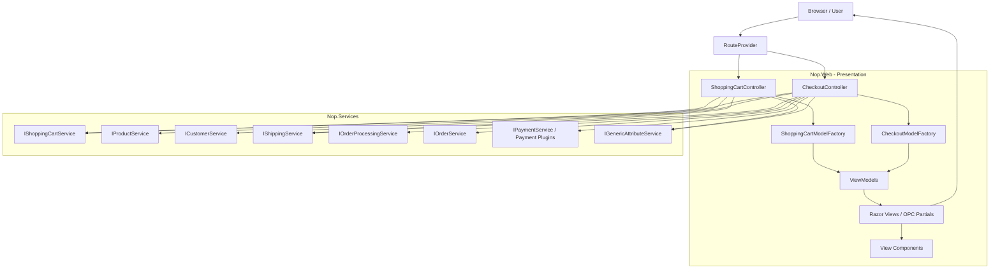
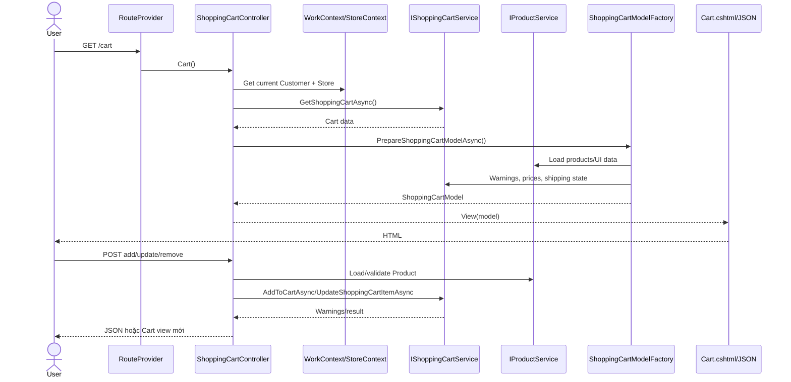
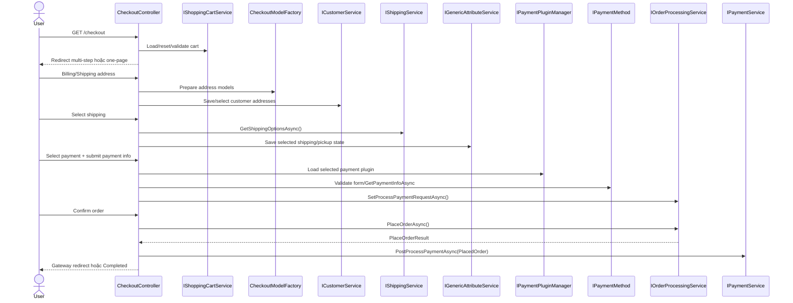
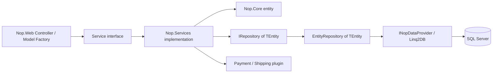
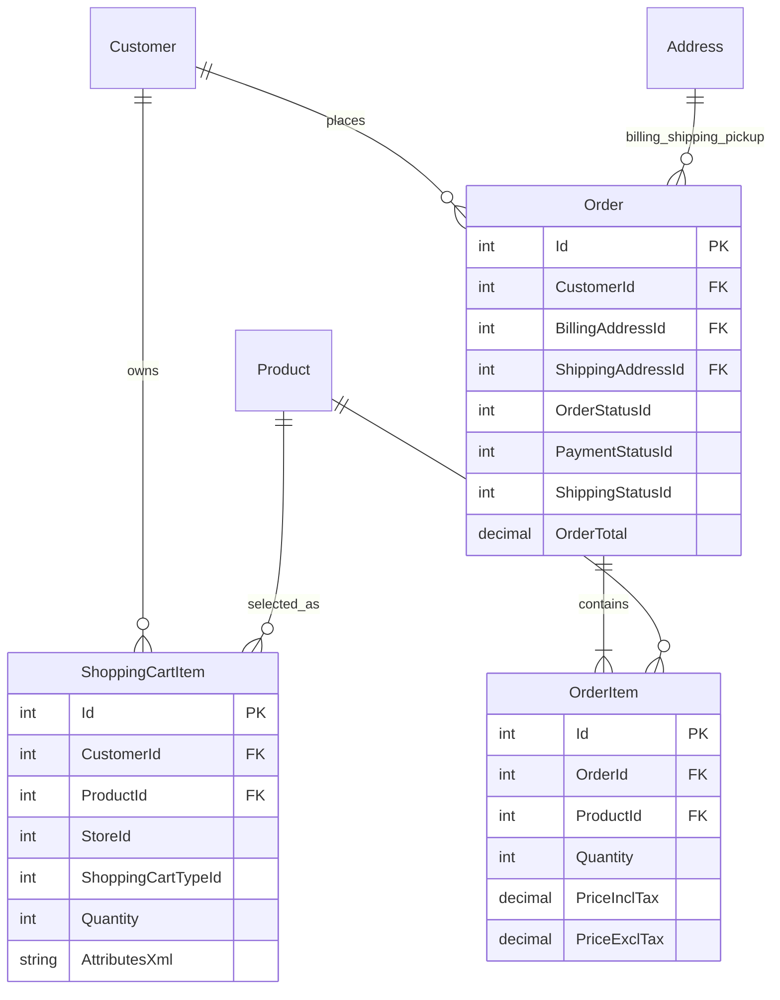
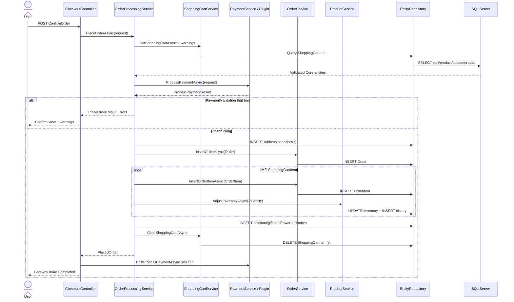

# T03 - Kiến trúc Shopping Cart và Checkout

## 1. Thông tin tài liệu

| Thuộc tính                          | Giá trị                                                                                                |
| ------------------------------------- | -------------------------------------------------------------------------------------------------------- |
| Deliverable                           | T03 -`docs/architecture.md`                                                                            |
| Source baseline                       | `674d0ceef6bd8a52fe74d6f4fff326960162cec0`                                                             |
| Trần Thị Phương Trang phụ trách | `Nop.Web`, `ShoppingCartController`, `CheckoutController`, Model Factory, ViewModel và Razor View |
| Đỗ Đặng Diệu Linh phụ trách    | `Nop.Services`, `Nop.Core` và database flow                                                         |
| Chức năng                           | Shopping Cart và Checkout storefront                                                                    |
| Ngoài phạm vi                       | Admin, Wishlist và các luồng ngoài`scope.md`                                                       |
| Trạng thái                          | In Progress - phần Nop.Web và phần Services/Core/database đã được bổ sung; chờ review nhóm     |

## 2. Mục tiêu và kết luận chính

Mục tiêu của phần Trang là xác định request Shopping Cart và Checkout đi qua những thành phần nào ở tầng web, Controller gọi service interface nào, dữ liệu được chuyển thành ViewModel ra sao và những nhánh nào phù hợp để thiết kế test trong phạm vi đã thống nhất tại [`scope.md`](../scope.md).

Kết luận chính:

- `Nop.Web` là tầng Presentation ASP.NET Core MVC, chịu trách nhiệm routing, điều phối request, validation ở mức web và tạo response.
- `ShoppingCartController` điều phối thêm, sửa, xóa sản phẩm, coupon, ước tính shipping và chuyển sang checkout.
- `CheckoutController` hoạt động như state machine cho hai chế độ multi-step và one-page checkout.
- Model Factory tổng hợp dữ liệu từ nhiều service rồi tạo ViewModel dành riêng cho UI.
- Controller chỉ biết các service qua interface được inject; implementation của service, Core entity và database flow nằm ngoài phạm vi tài liệu này.
- Tại ranh giới Nop.Web, lệnh đặt hàng được chuyển giao qua `IOrderProcessingService.PlaceOrderAsync`.
- Sau khi service trả về `PlacedOrder` thành công, Controller chuyển sang `IPaymentService.PostProcessPaymentAsync` hoặc trang Completed.

## 3. Kiến trúc component/container



Sơ đồ chỉ thể hiện các interface service mà `Nop.Web` phụ thuộc. Cách những service này xử lý Core entity và database thuộc tài liệu của Linh.

Dependency Injection đăng ký:

- `IShoppingCartModelFactory → ShoppingCartModelFactory`.
- `ICheckoutModelFactory → CheckoutModelFactory`.

Đăng ký nằm trong [`NopStartup.cs`](../src/Presentation/Nop.Web/Infrastructure/NopStartup.cs#L77).

## 4. Các module chính và dependency

| Module                       | Vai trò                                                                          | Dependency quan trọng                                                                                                      | Output                                                       |
| ---------------------------- | --------------------------------------------------------------------------------- | --------------------------------------------------------------------------------------------------------------------------- | ------------------------------------------------------------ |
| `RouteProvider`            | Ánh xạ URL sang Controller/action                                               | ASP.NET endpoint routing,`NopRouteNames`                                                                                  | Route values                                                 |
| `ShoppingCartController`   | Điều phối add/update/remove cart, coupon, shipping estimate và start checkout | `IShoppingCartService`, `IProductService`, `IShoppingCartModelFactory`                                                | View, redirect hoặc JSON                                    |
| `ShoppingCartModelFactory` | Chuyển cart/domain data thành model hiển thị                                  | Cart, product, order total, tax, currency và payment plugin services                                                       | `ShoppingCartModel`, `OrderTotalsModel`, estimate models |
| `CheckoutController`       | Điều phối các bước checkout và lệnh đặt hàng                           | `ICheckoutModelFactory`, `IShoppingCartService`, `IOrderProcessingService`, `IPaymentService`, `IShippingService` | View, redirect hoặc JSON section                            |
| `CheckoutModelFactory`     | Chuẩn bị address, shipping, payment, confirm và completed models               | Customer, address, shipping, order total, payment và reward point services                                                 | Các`Checkout...Model`                                     |
| Razor Views/View Components  | Render form, cart summary, totals và OPC sections                                | ViewModels, route names                                                                                                     | HTML và form/AJAX request                                   |

## 5. Request routing

Các route chính được định nghĩa trong [`RouteProvider.cs`](../src/Presentation/Nop.Web/Infrastructure/RouteProvider.cs).

| HTTP/URL                                                         | Controller.action                           | Chức năng                                  |
| ---------------------------------------------------------------- | ------------------------------------------- | -------------------------------------------- |
| `GET /{lang}/cart/`                                            | `ShoppingCartController.Cart`             | Hiển thị giỏ hàng                        |
| `POST /{lang}/cart/` + `updatecart`                          | `ShoppingCartController.UpdateCart`       | Cập nhật quantity hoặc xóa item          |
| `POST /{lang}/cart/` + `checkout`                            | `ShoppingCartController.StartCheckout`    | Validate và bắt đầu checkout             |
| `POST /addproducttocart/catalog/{productId}/{type}/{quantity}` | `AddProductToCart_Catalog`                | Thêm nhanh từ catalog                      |
| `POST /addproducttocart/details/{productId}/{type}`            | `AddProductToCart_Details`                | Thêm từ trang product detail               |
| `POST /cart/estimateshipping`                                  | `GetEstimateShipping`                     | Ước tính shipping qua AJAX                |
| `GET /{lang}/checkout/`                                        | `CheckoutController.Index`                | Entry point checkout                         |
| `GET/POST /{lang}/checkout/billingaddress`                     | `BillingAddress`/`NewBillingAddress`    | Billing address                              |
| `GET/POST /{lang}/checkout/shippingaddress`                    | `ShippingAddress`/`NewShippingAddress`  | Shipping address                             |
| `GET/POST /{lang}/checkout/shippingmethod`                     | `ShippingMethod`/`SelectShippingMethod` | Shipping method hoặc pickup                 |
| `GET/POST /{lang}/checkout/paymentmethod`                      | `PaymentMethod`/`SelectPaymentMethod`   | Payment method                               |
| `GET/POST /{lang}/checkout/paymentinfo`                        | `PaymentInfo`/`EnterPaymentInfo`        | Payment form                                 |
| `GET/POST /{lang}/checkout/confirm`                            | `Confirm`/`ConfirmOrder`                | Review và đặt hàng                       |
| `GET /{lang}/onepagecheckout/`                                 | `OnePageCheckout`                         | Khởi tạo one-page checkout                 |
| Các POST`OpcSave...`                                          | Các action OPC                             | Lưu từng bước và trả JSON/partial HTML |
| `GET /{lang}/checkout/completed/{orderId?}`                    | `Completed`                               | Hiển thị kết quả đặt hàng             |

## 6. Shopping Cart

### 6.1. Action và service dependency

| Action                       | Validation/nhánh chính                                                                    | Service/Factory                                                              | Response                                                |
| ---------------------------- | ------------------------------------------------------------------------------------------- | ---------------------------------------------------------------------------- | ------------------------------------------------------- |
| `Cart`                     | Quyền dùng cart, customer và store hiện tại                                            | `GetShoppingCartAsync`, `PrepareShoppingCartModelAsync`                  | `Cart.cshtml` + `ShoppingCartModel`                 |
| `AddProductToCart_Catalog` | Product tồn tại, simple product, min quantity, attributes, rental, customer-entered price | Product/attribute services,`AddToCartAsync`                                | JSON success/warnings hoặc redirect                    |
| `AddProductToCart_Details` | Quantity, attributes, gift card, rental dates, edit existing item                           | Product attribute parser,`AddToCartAsync`, `UpdateShoppingCartItemAsync` | JSON success/warnings/redirect                          |
| `UpdateCart`               | `removefromcart`, `itemquantity{id}`                                                    | Product service,`UpdateShoppingCartItemAsync`, model factory               | Cart view được render lại                           |
| `CheckoutAttributeChange`  | Checkout attributes và conditional attributes                                              | Attribute services, cart service, model factory                              | JSON totals/warnings/UI states                          |
| `ApplyDiscountCoupon`      | Coupon rỗng, không tồn tại, hết hạn hoặc hợp lệ                                    | Discount/customer services                                                   | Cart view với message                                  |
| `ApplyGiftCard`            | Gift card code và trạng thái cart                                                        | Gift card/cart services                                                      | Cart view với message                                  |
| `GetEstimateShipping`      | Country, state, zip hoặc city                                                              | `PrepareEstimateShippingResultModelAsync`                                  | JSON shipping options/errors                            |
| `StartCheckout`            | Checkout attributes, guest/registered, anonymous setting, downloadable product              | Cart/customer/product services                                               | Cart warnings, Challenge, login hoặc Checkout redirect |

Mã nguồn chính:

- [`ShoppingCartController.Cart`](../src/Presentation/Nop.Web/Controllers/ShoppingCartController.cs#L1246).
- [`ShoppingCartController.AddProductToCart_Catalog`](../src/Presentation/Nop.Web/Controllers/ShoppingCartController.cs#L593).
- [`ShoppingCartController.AddProductToCart_Details`](../src/Presentation/Nop.Web/Controllers/ShoppingCartController.cs#L791).
- [`ShoppingCartController.UpdateCart`](../src/Presentation/Nop.Web/Controllers/ShoppingCartController.cs#L1294).
- [`ShoppingCartController.StartCheckout`](../src/Presentation/Nop.Web/Controllers/ShoppingCartController.cs#L1377).

### 6.2. Data flow Shopping Cart



### 6.3. Chuyển từ Cart sang Checkout

`StartCheckout` thực hiện:

1. Lấy customer, store và cart hiện tại.
2. Parse và lưu checkout attributes.
3. Gọi `GetShoppingCartWarningsAsync` để validate.
4. Nếu có warning, tạo lại `ShoppingCartModel` và trả Cart view.
5. Nếu customer đã đăng ký hoặc anonymous checkout phù hợp, redirect tới `CheckoutController.Index`.
6. Nếu guest không được phép hoặc downloadable product bắt buộc đăng ký, trả `Challenge`.
7. Trường hợp còn lại redirect đến checkout-as-guest login.

## 7. Checkout

### 7.1. Multi-step checkout

| Bước           | Controller/action   | Factory method                         | ViewModel → View                                              | Nhánh quan trọng                                            |
| ---------------- | ------------------- | -------------------------------------- | -------------------------------------------------------------- | ------------------------------------------------------------- |
| Entry            | `Index`           | Không tạo model                      | Redirect                                                       | Cart rỗng/invalid, guest, payment button-only, checkout mode |
| Billing          | `BillingAddress`  | `PrepareBillingAddressModelAsync`    | `CheckoutBillingAddressModel` → `BillingAddress.cshtml`   | Existing/new, disable step, same address                      |
| Shipping address | `ShippingAddress` | `PrepareShippingAddressModelAsync`   | `CheckoutShippingAddressModel` → `ShippingAddress.cshtml` | Shipping required, address, pickup                            |
| Shipping method  | `ShippingMethod`  | `PrepareShippingMethodModelAsync`    | `CheckoutShippingMethodModel` → `ShippingMethod.cshtml`   | No shipping, pickup, 0/1/n options                            |
| Payment method   | `PaymentMethod`   | `PreparePaymentMethodModelAsync`     | `CheckoutPaymentMethodModel` → `PaymentMethod.cshtml`     | Payment required, reward points, plugin count                 |
| Payment info     | `PaymentInfo`     | `PreparePaymentInfoModelAsync`       | `CheckoutPaymentInfoModel` → `PaymentInfo.cshtml`         | Skip payment info, plugin component                           |
| Review           | `Confirm`         | `PrepareConfirmOrderModelAsync`      | `CheckoutConfirmModel` → `Confirm.cshtml`                 | Terms, captcha, min total                                     |
| Place order      | `ConfirmOrder`    | Chuẩn bị lại confirm model khi lỗi | Redirect hoặc Confirm view                                    | Duplicate interval, payment request, place order              |
| Done             | `Completed`       | `PrepareCheckoutCompletedModelAsync` | `CheckoutCompletedModel` → `Completed.cshtml`             | Order ownership/deleted status                                |

### 7.2. One-page checkout

`OnePageCheckout` tạo `OnePageCheckoutModel`; JavaScript gửi từng bước qua AJAX và Controller trả `UpdateSectionJsonModel` gồm tên section và HTML partial.

> One-page checkout được mô tả để hoàn chỉnh kiến trúc. Baseline kiểm thử hiện tại dùng multi-step checkout theo `scope.md`; không trộn hai mode trong cùng lượt Pairwise nếu nhóm chưa thay đổi cấu hình đã khóa.

| Action                            | Công việc                                                                | Kết quả kế tiếp                                      |
| --------------------------------- | -------------------------------------------------------------------------- | -------------------------------------------------------- |
| `OpcSaveBilling`                | Chọn/tạo billing address, xác định same-address và shipping required | Shipping, shipping method, payment hoặc confirm section |
| `OpcSaveShipping`               | Chọn/tạo shipping address hoặc pickup                                   | Shipping method hoặc payment                            |
| `OpcSaveShippingMethod`         | Validate và lưu shipping option/pickup                                   | Payment method, payment info hoặc confirm               |
| `OpcSavePaymentMethod`          | Lưu reward points và selected payment method                             | Payment info hoặc confirm                               |
| `OpcSavePaymentInfo`            | Validate plugin form và lưu`ProcessPaymentRequest`                     | Confirm hoặc payment-info có lỗi                      |
| `OpcConfirmOrder`               | Captcha, duplicate interval và place order                                | Success, error section hoặc redirect URL                |
| `OpcCompleteRedirectionPayment` | Post-process Order vừa tạo ngoài AJAX                                   | Payment gateway hoặc Completed                          |

### 7.3. Data flow Checkout



## 8. Model Factory và ViewModel

### 8.1. Mapping Factory → ViewModel → View

| Action/component         | Factory method                              | ViewModel                        | View/response                              |
| ------------------------ | ------------------------------------------- | -------------------------------- | ------------------------------------------ |
| `Cart`, `UpdateCart` | `PrepareShoppingCartModelAsync`           | `ShoppingCartModel`            | `ShoppingCart/Cart.cshtml`               |
| Estimate shipping        | `PrepareEstimateShippingResultModelAsync` | `EstimateShippingResultModel`  | JSON                                       |
| Flyout cart              | `PrepareMiniShoppingCartModelAsync`       | `MiniShoppingCartModel`        | View Component                             |
| Order totals             | `PrepareOrderTotalsModelAsync`            | `OrderTotalsModel`             | View Component                             |
| Billing                  | `PrepareBillingAddressModelAsync`         | `CheckoutBillingAddressModel`  | `BillingAddress`/`OpcBillingAddress`   |
| Shipping address         | `PrepareShippingAddressModelAsync`        | `CheckoutShippingAddressModel` | `ShippingAddress`/`OpcShippingAddress` |
| Shipping method          | `PrepareShippingMethodModelAsync`         | `CheckoutShippingMethodModel`  | `ShippingMethod`/`OpcShippingMethods`  |
| Payment method           | `PreparePaymentMethodModelAsync`          | `CheckoutPaymentMethodModel`   | `PaymentMethod`/`OpcPaymentMethods`    |
| Payment info             | `PreparePaymentInfoModelAsync`            | `CheckoutPaymentInfoModel`     | `PaymentInfo`/`OpcPaymentInfo`         |
| Confirm                  | `PrepareConfirmOrderModelAsync`           | `CheckoutConfirmModel`         | `Confirm`/`OpcConfirmOrder`            |
| One-page entry           | `PrepareOnePageCheckoutModelAsync`        | `OnePageCheckoutModel`         | `OnePageCheckout.cshtml`                 |
| Completed                | `PrepareCheckoutCompletedModelAsync`      | `CheckoutCompletedModel`       | `Completed.cshtml`                       |

### 8.2. ViewModel quan trọng

| ViewModel                        | Dữ liệu/flag ảnh hưởng UI                                                             |
| -------------------------------- | ------------------------------------------------------------------------------------------ |
| `ShoppingCartModel`            | Items, warnings, checkout attributes, edit/checkout flags, terms, discount/gift card boxes |
| `ShoppingCartItemModel`        | Product, attributes, prices, quantity, warnings, rental/recurring flags                    |
| `OrderTotalsModel`             | Subtotal, shipping, tax, discount, gift card, reward points và total                      |
| `CheckoutBillingAddressModel`  | Existing/invalid addresses, new address, same-address và VAT                              |
| `CheckoutShippingAddressModel` | Existing/invalid addresses, new address và pickup model                                   |
| `CheckoutShippingMethodModel`  | Shipping methods, fees, selected option, desired dates, pickup và warnings                |
| `CheckoutPaymentMethodModel`   | Payment plugin methods, fees, selected method và reward points                            |
| `CheckoutPaymentInfoModel`     | Payment ViewComponent và flag hiển thị totals                                           |
| `CheckoutConfirmModel`         | Terms, captcha, min-order warning và place-order warnings                                 |
| `OnePageCheckoutModel`         | Shipping required, disable billing step, captcha và billing section                       |
| `UpdateSectionJsonModel`       | Tên OPC section và server-rendered partial HTML                                          |

ViewModel chỉ phục vụ hiển thị và binding request; không phải entity được lưu trực tiếp vào database.

## 9. Nop.Services, Nop.Core và database flow

> **Phụ trách: Đỗ Đặng Diệu Linh.** Phần này nối điểm handoff ở `Nop.Web` với xử lý nghiệp vụ trong `Nop.Services`, mô hình miền trong `Nop.Core` và cơ chế lưu trữ của `Nop.Data`. Phạm vi chỉ gồm Shopping Cart và Checkout storefront.

### 9.1. Vai trò và ranh giới của các tầng

| Tầng | Trách nhiệm trong luồng Cart/Checkout | Không chịu trách nhiệm |
| --- | --- | --- |
| `Nop.Core` | Khai báo domain entity, enum và cấu hình như `ShoppingCartItem`, `Order`, `OrderItem`, `ShoppingCartType`, `OrderStatus`, `PaymentStatus` và `ShippingStatus` | Không truy vấn database và không điều phối request web |
| `Nop.Services` | Thực thi validation và nghiệp vụ; tính giá/tổng tiền; gọi payment/shipping plugin; chuyển cart thành order; gọi repository để đọc ghi | Không render View/Razor và không chứa chi tiết SQL Server |
| `Nop.Data` | Cung cấp `IRepository<TEntity>`, `EntityRepository<TEntity>`, mapping, migration và `INopDataProvider`; chuyển LINQ/CRUD thành thao tác database | Không quyết định quy tắc add-to-cart, checkout hoặc payment |

Controller và Model Factory chỉ phụ thuộc vào interface service. Dependency Injection chọn implementation, còn service nhận generic repository hoặc gọi service chuyên trách khác. Luồng phụ thuộc chính là:



`NopDbStartup` đăng ký `IRepository<> → EntityRepository<>` theo scoped lifetime và đăng ký `INopDataProvider` theo database provider đang cấu hình. Với môi trường của nhóm, provider cuối là SQL Server.

### 9.2. Service implementation chính

| Service | Vai trò | Điểm đọc/ghi hoặc dependency quan trọng |
| --- | --- | --- |
| `ShoppingCartService` | Đọc cart; validate product, attributes, quantity, stock; thêm, cập nhật hoặc xóa cart item; reset checkout data | Dùng trực tiếp `IRepository<ShoppingCartItem>` và gọi product, customer, attribute, shipping services |
| `OrderProcessingService` | Điều phối toàn bộ use case đặt hàng từ validation đến tạo order, order item, lịch sử, inventory, event và notification | Gọi `IShoppingCartService`, `IOrderService`, `IPaymentService`, `IProductService`, `IAddressService` và các service discount/gift card/reward point |
| `OrderService` | Cung cấp query và CRUD cho `Order`, `OrderItem`, `OrderNote`, recurring payment | Bao `IRepository<Order>`, `IRepository<OrderItem>` và các repository thuộc Orders |
| `PaymentService` | Chọn payment plugin theo system name; xử lý payment thường/recurring và post-process redirect | `ProcessPaymentAsync` trả `ProcessPaymentResult`; order tổng bằng 0 được đánh dấu `Paid`; `PostProcessPaymentAsync` giao tiếp plugin sau khi order đã được tạo |
| `ShippingService` | Xác định trọng lượng/package và tổng hợp shipping option từ plugin đang hoạt động | Đọc cart/product/address; gọi từng shipping rate computation plugin |
| `ProductService` | Đọc product và điều chỉnh inventory sau khi tạo order item | Cập nhật `Product` hoặc tổ hợp/warehouse inventory và thêm `StockQuantityHistory` khi phù hợp |

Các service hỗ trợ như `OrderTotalCalculationService`, `AddressService`, `GenericAttributeService`, `DiscountService`, `GiftCardService` và `RewardPointService` được gọi trong checkout, nhưng không phải entry point từ Controller.

### 9.3. Core entity và quan hệ dữ liệu

| Entity | Trường quyết định trong phạm vi | Ý nghĩa |
| --- | --- | --- |
| `ShoppingCartItem` | `CustomerId`, `ProductId`, `StoreId`, `ShoppingCartTypeId`, `AttributesXml`, `Quantity`, `CreatedOnUtc`, `UpdatedOnUtc` | Trạng thái giỏ có thể thay đổi trước khi checkout; giá cuối cùng chưa được cố định tại đây |
| `Product` | `ManageInventoryMethodId`, `StockQuantity`, `MinStockQuantity`, `BackorderModeId`, `OrderMinimumQuantity`, `OrderMaximumQuantity` | Nguồn quy tắc về khả dụng và tồn kho khi validate cart |
| `Customer` | `BillingAddressId`, `ShippingAddressId`, currency/language và các generic attribute | Chủ cart/order và nơi giữ lựa chọn checkout tạm thời |
| `Address` | Email, country/state, city, address và postal code | Khi đặt hàng, billing/shipping/pickup address được clone và lưu thành bản ghi riêng cho order |
| `Order` | `CustomerId`, address IDs, totals, `OrderStatusId`, `PaymentStatusId`, `ShippingStatusId`, payment/shipping system name | Header và snapshot tài chính/trạng thái tại thời điểm đặt hàng |
| `OrderItem` | `OrderId`, `ProductId`, `Quantity`, giá gồm/không gồm thuế, discount, attributes, weight | Snapshot từng dòng cart; không chỉ tham chiếu cart item cũ |

Quan hệ chính trong database:



### 9.4. Shopping Cart service flow

#### Đọc cart

`ShoppingCartService.GetShoppingCartAsync` tạo query từ `IRepository<ShoppingCartItem>.Table` và luôn lọc theo `CustomerId`. Các filter tiếp theo gồm cart type, wishlist, store, product và thời gian. Filter store được bỏ qua nếu cấu hình cho phép chia sẻ cart giữa các store. Kết quả query được materialize bằng `ToListAsync` và đi qua short-term cache.

#### Thêm, cập nhật và xóa

1. `AddToCartAsync` kiểm tra cart hiện tại và tìm item tương đương theo product, attributes, customer-entered price và rental dates.
2. Service chạy validation về quyền truy cập, trạng thái product, attributes, required products, quantity, stock và giới hạn số item.
3. Nếu item tương đương đã có, service cộng quantity rồi gọi `_sciRepository.UpdateAsync`.
4. Nếu chưa có, service tạo `ShoppingCartItem` rồi gọi `_sciRepository.InsertAsync`.
5. `UpdateShoppingCartItemAsync` chỉ sửa item thuộc đúng customer. Quantity lớn hơn 0 được validate rồi update; quantity bằng hoặc nhỏ hơn 0 chuyển sang delete.
6. `DeleteShoppingCartItemAsync` reset dữ liệu checkout liên quan, xóa bản ghi bằng repository và cập nhật cờ customer có cart item.
7. `ClearShoppingCartAsync` bulk-delete các item của shopping cart, phát `ClearShoppingCartEvent`, rồi cập nhật trạng thái customer.

Validation xảy ra trước lệnh insert/update. Khi trả về danh sách warning, Controller có thể hiển thị lỗi mà không ghi thay đổi cart không hợp lệ.

```mermaid
sequenceDiagram
    participant Web as ShoppingCartController
    participant Cart as ShoppingCartService
    participant Product as Product/Attribute Services
    participant Repo as IRepository<ShoppingCartItem>
    participant DB as ShoppingCartItem table

    Web->>Cart: AddToCartAsync / UpdateShoppingCartItemAsync
    Cart->>Repo: Table / GetByIdAsync
    Repo->>DB: SELECT by Customer/Product/Store
    DB-->>Repo: Current cart item(s)
    Repo-->>Cart: Core entities
    Cart->>Product: Validate product, attributes, quantity, stock
    alt Có warning
        Product-->>Cart: Warning list
        Cart-->>Web: Warnings; không ghi cart change
    else Item tương đương đã tồn tại
        Cart->>Repo: UpdateAsync(ShoppingCartItem)
        Repo->>DB: UPDATE ShoppingCartItem
        Cart-->>Web: Empty warning list
    else Item mới
        Cart->>Repo: InsertAsync(ShoppingCartItem)
        Repo->>DB: INSERT ShoppingCartItem
        Cart-->>Web: Empty warning list
    end
```

### 9.5. Checkout và PlaceOrder flow

Điểm vào nghiệp vụ là `OrderProcessingService.PlaceOrderAsync`. Method này không dùng dữ liệu form để tạo order trực tiếp mà nạp lại customer/cart và validate trạng thái hiện tại trước khi ghi dữ liệu.

#### Giai đoạn chuẩn bị và validation

`PreparePlaceOrderDetailsAsync` lần lượt:

1. Nạp customer, kiểm tra guest checkout, currency và language.
2. Nạp `ShoppingCartItem` từ database; kiểm tra cart rỗng, cart warnings, từng item và minimum order totals.
3. Nạp billing address và clone thành snapshot; chuẩn bị shipping hoặc pickup address nếu cart cần vận chuyển.
4. Đọc checkout attributes, selected shipping option và pickup point từ `GenericAttribute` của customer.
5. Tính subtotal, shipping, payment fee, tax, discount, gift card, reward points và order total.
6. Kiểm tra recurring cart nếu có.

Nếu một bước chuẩn bị thất bại, exception được truyền về Controller để khối `try/catch` của action ghi log và đưa message vào warnings; phần tạo order chưa được bắt đầu. Các exception phát sinh bên trong giai đoạn payment/ghi order được local function của `PlaceOrderAsync` bắt và chuyển thành lỗi của `PlaceOrderResult`.

#### Giai đoạn payment và ghi order

1. `GetProcessPaymentResultAsync` kiểm tra payment workflow. Nếu cần payment, service nạp plugin đang hoạt động và gọi `PaymentService.ProcessPaymentAsync`; nếu không cần payment thì tạo kết quả `Paid`.
2. Chỉ khi `ProcessPaymentResult.Success` là `true`, `SaveOrderDetailsAsync` mới chạy.
3. Billing address luôn được insert; pickup và shipping address được insert khi có.
4. `Order` được tạo với totals, currency, payment/shipping data và trạng thái ban đầu: `OrderStatus.Pending`, payment status từ processor, shipping status theo loại cart.
5. `OrderService.InsertOrderAsync` insert order; sau khi có ID, custom order number được sinh và order được update.
6. `MoveShoppingCartItemsToOrderItemsAsync` tính lại giá/thuế/discount cho từng cart item, tạo `OrderItem`, điều chỉnh inventory và phát `ShoppingCartItemMovedToOrderItemEvent`.
7. Service lưu `DiscountUsageHistory`, `GiftCardUsageHistory`, recurring payment và reward point history khi áp dụng.
8. Sau khi chuyển hết item, `ClearShoppingCartAsync` xóa các `ShoppingCartItem` của store.
9. Service lưu note/notification, reset checkout attributes, phát `OrderPlacedEvent`, kiểm tra lại order status và xử lý nhánh paid.
10. Sau khi `PlaceOrderAsync` thành công, Controller mới gọi `PaymentService.PostProcessPaymentAsync` cho payment gateway cần redirect hoặc POST ngoài hệ thống.

Nếu `OrderSettings.PlaceOrderWithLock` được bật, service dùng mutex theo customer cùng cache key có thời hạn để hạn chế hai yêu cầu đặt hàng đồng thời. Controller cũng kiểm tra minimum order placement interval; hai cơ chế này là hàng rào chống submit trùng, không thay thế việc kiểm tra dữ liệu order thực tế.



### 9.6. Repository và database access

`EntityRepository<TEntity>` thực thi contract của `IRepository<TEntity>`:

| Repository operation | Data-provider operation | Hiệu ứng bổ sung |
| --- | --- | --- |
| `Table`, `GetByIdAsync`, LINQ query | `GetTable<TEntity>()` rồi materialize bằng Linq2DB | Có thể dùng short-term/static cache tùy lời gọi |
| `InsertAsync` | `InsertEntityAsync` | Phát `EntityInsertedAsync` theo mặc định |
| `UpdateAsync` | `UpdateEntityAsync` | Phát `EntityUpdatedAsync` theo mặc định |
| `DeleteAsync` | `DeleteEntityAsync` hoặc update cờ `Deleted` | Phát `EntityDeletedAsync` theo mặc định |
| Bulk insert/delete | Bulk provider API trong transaction scope của chính repository operation | Phát event từng entity nếu được yêu cầu |

Entity triển khai `ISoftDeletedEntity`, ví dụ `Order`, `Product` và `Customer`, được đánh dấu `Deleted = true` khi gọi repository delete. `ShoppingCartItem` không triển khai interface này nên bị xóa vật lý. Mapping builder khai báo foreign key từ cart item tới customer/product, từ order tới customer/address và từ order item tới order/product.

`PlaceOrderAsync` gọi nhiều repository/service operation nối tiếp nhau nhưng không tạo một transaction scope bao trùm toàn bộ use case trong method. Transaction scope nhìn thấy trong `EntityRepository` chỉ bao một số bulk operation. Vì vậy lỗi giữa chuỗi ghi dữ liệu là rủi ro tích hợp cần được kiểm thử và quan sát qua order/cart/inventory/history, thay vì giả định toàn bộ bước tự động rollback như một transaction duy nhất.

### 9.7. Entity-table mapping và thay đổi dữ liệu

Theo convention hiện tại, tên bảng chính trùng tên entity. Các builder bổ sung foreign key, độ dài, nullable và unique constraint.

| Entity / bảng | Thời điểm đọc | Thời điểm ghi |
| --- | --- | --- |
| `ShoppingCartItem` | Hiển thị cart, validate cart, tính totals, bắt đầu checkout | Insert khi add mới; update quantity/attributes; delete khi remove hoặc đặt hàng thành công |
| `Product` | Validate trạng thái, giá, attributes và stock | Update tồn kho trực tiếp hoặc qua inventory theo cấu hình product |
| `Customer` | Xác định owner, guest, currency/language và address IDs | Có thể cập nhật cờ cart và checkout-related customer state |
| `GenericAttribute` | Đọc checkout attributes, selected shipping option, pickup point và các lựa chọn tạm | Lưu/reset lựa chọn checkout, coupon và dữ liệu tạm của customer |
| `Address` | Đọc address hiện tại của customer | Insert snapshot billing, shipping hoặc pickup cho order |
| `Order` | Trang completed, quản lý và xử lý trạng thái sau đặt hàng | Insert header; update custom number, reward reference và trạng thái |
| `OrderItem` | Hiển thị chi tiết đơn, fulfillment và download | Insert một bản ghi cho mỗi cart item |
| `StockQuantityHistory` | Audit thay đổi tồn kho | Insert khi `AdjustInventoryAsync` thay đổi inventory phù hợp |
| `DiscountUsageHistory` | Kiểm tra lịch sử sử dụng discount | Insert cho mỗi discount đã áp dụng |
| `GiftCardUsageHistory` | Tính phần giá trị gift card đã dùng | Insert cho mỗi gift card được dùng trong order |
| `RewardPointsHistory` | Tính số điểm khả dụng và audit | Insert entry trừ điểm khi redeem; entry cộng điểm tùy trạng thái/order settings |

Trạng thái dữ liệu điển hình:

```text
Trước checkout
  ShoppingCartItem tồn tại; Order và OrderItem chưa tồn tại.

PlaceOrder thành công
  Address snapshot(s) + Order + OrderItem(s) được thêm.
  Inventory và các usage/history record được cập nhật khi áp dụng.
  ShoppingCartItem được xóa.

Payment dạng redirect
  Order có thể đã tồn tại ở trạng thái Pending trước khi người dùng hoàn tất ở gateway.
  Callback hoặc xử lý payment tiếp theo mới chuyển payment/order status.
```

### 9.8. Điểm kiểm thử rút ra từ service và database flow

| Rủi ro/nhánh | Invariant cần kiểm tra |
| --- | --- |
| Cart thuộc customer/store khác | Không đọc, sửa hoặc xóa được item không thuộc customer hiện tại; store filter đúng theo cấu hình shared cart |
| Add/update có warning | Không phát sinh insert/update ngoài ý muốn; quantity và attributes cũ được giữ nguyên |
| Quantity bằng 0 | Cart item bị xóa và checkout data liên quan được reset đúng |
| Hết hàng hoặc vượt giới hạn | Checkout bị chặn trước khi tạo `Order` |
| Payment processor trả lỗi | `PlaceOrderResult` có lỗi; không trả `PlacedOrder` thành công |
| Payment tổng bằng 0/không yêu cầu payment | Payment status phù hợp và không gọi plugin không cần thiết |
| Order thành công | Có đúng một `Order`; số `OrderItem` và quantity khớp cart; totals và attributes được snapshot |
| Shipping required/not required/pickup | Address IDs, shipping method và `ShippingStatus` nhất quán |
| Inventory-managed product | Tồn kho giảm đúng quantity và có history phù hợp; product không quản lý tồn kho không bị giảm sai |
| Discount/gift card/reward points | Usage/history gắn đúng `OrderId` và không bị ghi lặp khi submit lại |
| Sau đặt hàng | Cart của đúng customer/store được làm sạch; checkout attributes/coupon được reset |
| Redirection payment | Order Pending vẫn tồn tại trước redirect; post-process/callback cập nhật trạng thái đúng và không tạo order trùng |
| Lỗi giữa chuỗi persistence | Kiểm tra dữ liệu dở dang giữa `Order`, `OrderItem`, inventory, histories và cart vì không có transaction bao toàn bộ method |

### 9.9. Mã nguồn đối chiếu

- Core entities: [`ShoppingCartItem.cs`](../src/Libraries/Nop.Core/Domain/Orders/ShoppingCartItem.cs), [`Order.cs`](../src/Libraries/Nop.Core/Domain/Orders/Order.cs), [`OrderItem.cs`](../src/Libraries/Nop.Core/Domain/Orders/OrderItem.cs), [`Product.cs`](../src/Libraries/Nop.Core/Domain/Catalog/Product.cs), [`Customer.cs`](../src/Libraries/Nop.Core/Domain/Customers/Customer.cs), [`Address.cs`](../src/Libraries/Nop.Core/Domain/Common/Address.cs).
- Cart: [`IShoppingCartService.cs`](../src/Libraries/Nop.Services/Orders/IShoppingCartService.cs), [`ShoppingCartService.cs`](../src/Libraries/Nop.Services/Orders/ShoppingCartService.cs).
- Order: [`IOrderProcessingService.cs`](../src/Libraries/Nop.Services/Orders/IOrderProcessingService.cs), [`OrderProcessingService.cs`](../src/Libraries/Nop.Services/Orders/OrderProcessingService.cs), [`OrderService.cs`](../src/Libraries/Nop.Services/Orders/OrderService.cs).
- Payment và shipping: [`PaymentService.cs`](../src/Libraries/Nop.Services/Payments/PaymentService.cs), [`ShippingService.cs`](../src/Libraries/Nop.Services/Shipping/ShippingService.cs).
- Persistence: [`IRepository.cs`](../src/Libraries/Nop.Data/IRepository.cs), [`EntityRepository.cs`](../src/Libraries/Nop.Data/EntityRepository.cs), [`INopDataProvider.cs`](../src/Libraries/Nop.Data/INopDataProvider.cs), [`NopDbStartup.cs`](../src/Libraries/Nop.Data/NopDbStartup.cs).
- Mapping: [`ShoppingCartItemBuilder.cs`](../src/Libraries/Nop.Data/Mapping/Builders/Orders/ShoppingCartItemBuilder.cs), [`OrderBuilder.cs`](../src/Libraries/Nop.Data/Mapping/Builders/Orders/OrderBuilder.cs), [`OrderItemBuilder.cs`](../src/Libraries/Nop.Data/Mapping/Builders/Orders/OrderItemBuilder.cs).

## 10. Điểm handoff từ Controller

### 10.1. Handoff đặt hàng

Từ góc nhìn `Nop.Web`:

1. Người dùng POST `ConfirmOrder` hoặc `OpcConfirmOrder`.
2. `CheckoutController` validate cart, guest/captcha và khoảng thời gian chống đặt trùng.
3. Controller lấy `ProcessPaymentRequest` qua `IOrderProcessingService`.
4. Controller gọi `_orderProcessingService.PlaceOrderAsync(processPaymentRequest)`.
5. Nếu kết quả thành công, Controller nhận `PlacedOrder`; chi tiết service tạo và lưu Order thuộc phần của Linh.
6. Controller gọi post-process payment hoặc chuyển tới trang Completed.

Nguồn phía Web: [`CheckoutController.ConfirmOrder`](../src/Presentation/Nop.Web/Controllers/CheckoutController.cs#L1278) và [`CheckoutController.OpcConfirmOrder`](../src/Presentation/Nop.Web/Controllers/CheckoutController.cs#L2019).

### 10.2. Handoff payment

| Giai đoạn ở Nop.Web | Lời gọi/hoạt động                                      | Trách nhiệm của Web                                                 |
| ---------------------- | ----------------------------------------------------------- | ---------------------------------------------------------------------- |
| Chuẩn bị UI          | `CheckoutModelFactory.PreparePaymentMethodModelAsync`     | Tạo danh sách phương thức và dữ liệu hiển thị                |
| Submit payment info    | Plugin`ValidatePaymentFormAsync`, `GetPaymentInfoAsync` | Validate form và chuyển payment request cho order-processing service |
| Confirm                | `IOrderProcessingService.PlaceOrderAsync`                 | Gửi lệnh đặt hàng và nhận`PlaceOrderResult`                   |
| Sau success            | `IPaymentService.PostProcessPaymentAsync`                 | Cho phép redirect/POST tới payment gateway nếu cần                 |

Với one-page checkout và redirection payment, `OpcConfirmOrder` trả URL tới `OpcCompleteRedirectionPayment` vì AJAX không thực hiện external redirect trực tiếp. Cách payment service/plugin xử lý bên trong thuộc phần của Linh.

## 11. Điểm phù hợp để tạo Pairwise Test

Các factor dưới đây bám theo phạm vi đã khóa tại `scope.md`. Đây là đầu vào đề xuất cho task Pairwise; model và generated cases chính thức thuộc T06-T07.

### 11.1. Factors trong phạm vi

| Factor                | Values đề xuất                                                    | Nhánh Controller/ViewModel liên quan                       |
| --------------------- | -------------------------------------------------------------------- | ------------------------------------------------------------ |
| Customer              | Registered / Guest khi anonymous checkout được bật               | `StartCheckout`, `CheckoutController.Index`              |
| Product configuration | Simple / Có attributes và tổ hợp hợp lệ                        | Hai action`AddProductToCart...`, product attribute parsing |
| Stock state           | Đủ hàng / Đúng giới hạn / Vượt kho hoặc hết hàng         | Cart warnings và add/update result                          |
| Cart action           | Add / Update quantity / Remove                                       | `AddProductToCart...`, `UpdateCart`                      |
| Coupon                | None / Valid / Invalid                                               | `ApplyDiscountCoupon`, Cart messages/totals                |
| Checkout address      | Valid / Thiếu hoặc sai trường bắt buộc                         | Billing/Shipping address actions và ModelState              |
| Shipping              | Local method khả dụng / Không áp dụng khi item không cần ship | `ShippingMethod` và các nhánh skip                      |
| Payment               | Check/Money Order local / Decline giả lập khi có test processor   | Payment method/info và confirm result                       |

### 11.2. Constraints cần chuyển sang Pairwise model

- Guest chỉ hợp lệ khi anonymous checkout được bật.
- Item không cần ship không kết hợp với lựa chọn shipping method.
- Remove làm cart rỗng thì không tiếp tục checkout.
- Mức kho đúng giới hạn hoặc vượt kho chỉ dùng với sản phẩm thực sự quản lý tồn kho.
- Product có attributes chỉ dùng tổ hợp tồn tại và fixture tồn kho đã biết.
- Payment decline chỉ hợp lệ khi có processor giả lập chạy local; nếu chưa có phải ghi `Blocked`.
- Baseline hiện dùng multi-step checkout; one-page checkout không phải factor của lượt Pairwise này.

### 11.3. Các nhánh kiểm thử riêng, không thay thế Pairwise

- Quantity dưới minimum, vượt maximum hoặc dữ liệu không đọc được.
- Cart rỗng hoặc cart có warning khi bắt đầu checkout.
- Shipping/payment option thiếu hoặc không còn khả dụng.
- Captcha sai, minimum-order không đạt và khoảng thời gian chống đặt trùng nếu cấu hình tương ứng được bật.
- One-page checkout chỉ kiểm tra trong lượt cấu hình riêng nếu nhóm quyết định mở rộng phạm vi.

## 12. Danh sách class/file quan trọng

| Nhóm                                       | File                                                                                                                                                                                                                                                                                                    |
| ------------------------------------------- | ------------------------------------------------------------------------------------------------------------------------------------------------------------------------------------------------------------------------------------------------------------------------------------------------------- |
| Routing/DI                                  | [`RouteProvider.cs`](../src/Presentation/Nop.Web/Infrastructure/RouteProvider.cs), [`NopStartup.cs`](../src/Presentation/Nop.Web/Infrastructure/NopStartup.cs)                                                                                                                                        |
| Controllers                                 | [`ShoppingCartController.cs`](../src/Presentation/Nop.Web/Controllers/ShoppingCartController.cs), [`CheckoutController.cs`](../src/Presentation/Nop.Web/Controllers/CheckoutController.cs)                                                                                                            |
| Model Factories                             | [`ShoppingCartModelFactory.cs`](../src/Presentation/Nop.Web/Factories/ShoppingCartModelFactory.cs), [`CheckoutModelFactory.cs`](../src/Presentation/Nop.Web/Factories/CheckoutModelFactory.cs)                                                                                                        |
| Factory contracts                           | [`IShoppingCartModelFactory.cs`](../src/Presentation/Nop.Web/Factories/IShoppingCartModelFactory.cs), [`ICheckoutModelFactory.cs`](../src/Presentation/Nop.Web/Factories/ICheckoutModelFactory.cs)                                                                                                    |
| Cart models                                 | [`ShoppingCartModel.cs`](../src/Presentation/Nop.Web/Models/ShoppingCart/ShoppingCartModel.cs), [`OrderTotalsModel.cs`](../src/Presentation/Nop.Web/Models/ShoppingCart/OrderTotalsModel.cs), [`EstimateShippingModel.cs`](../src/Presentation/Nop.Web/Models/ShoppingCart/EstimateShippingModel.cs) |
| Checkout models                             | [`Models/Checkout`](../src/Presentation/Nop.Web/Models/Checkout)                                                                                                                                                                                                                                       |
| Views                                       | [`Views/ShoppingCart`](../src/Presentation/Nop.Web/Views/ShoppingCart), [`Views/Checkout`](../src/Presentation/Nop.Web/Views/Checkout)                                                                                                                                                                |
| Service interfaces được Controller dùng     | `IShoppingCartService`, `IOrderProcessingService`, `IPaymentService`, `IShippingService`, `ICustomerService`                                                                                                                                                                                           |
| Service implementations                     | [`ShoppingCartService.cs`](../src/Libraries/Nop.Services/Orders/ShoppingCartService.cs), [`OrderProcessingService.cs`](../src/Libraries/Nop.Services/Orders/OrderProcessingService.cs), [`OrderService.cs`](../src/Libraries/Nop.Services/Orders/OrderService.cs), [`PaymentService.cs`](../src/Libraries/Nop.Services/Payments/PaymentService.cs), [`ShippingService.cs`](../src/Libraries/Nop.Services/Shipping/ShippingService.cs) |
| Core entities                               | [`ShoppingCartItem.cs`](../src/Libraries/Nop.Core/Domain/Orders/ShoppingCartItem.cs), [`Order.cs`](../src/Libraries/Nop.Core/Domain/Orders/Order.cs), [`OrderItem.cs`](../src/Libraries/Nop.Core/Domain/Orders/OrderItem.cs), [`Product.cs`](../src/Libraries/Nop.Core/Domain/Catalog/Product.cs), [`Customer.cs`](../src/Libraries/Nop.Core/Domain/Customers/Customer.cs) |
| Data access và mapping                      | [`IRepository.cs`](../src/Libraries/Nop.Data/IRepository.cs), [`EntityRepository.cs`](../src/Libraries/Nop.Data/EntityRepository.cs), [`ShoppingCartItemBuilder.cs`](../src/Libraries/Nop.Data/Mapping/Builders/Orders/ShoppingCartItemBuilder.cs), [`OrderBuilder.cs`](../src/Libraries/Nop.Data/Mapping/Builders/Orders/OrderBuilder.cs), [`OrderItemBuilder.cs`](../src/Libraries/Nop.Data/Mapping/Builders/Orders/OrderItemBuilder.cs) |

## 13. Acceptance checklist và review

- [X] Có sơ đồ kiến trúc component/container.
- [X] Có data flow Shopping Cart.
- [X] Có data flow Checkout.
- [X] Giải thích ít nhất 3-5 module.
- [X] Có danh sách class/file quan trọng.
- [X] Xác định điểm Controller bàn giao lệnh đặt hàng và post-process payment.
- [X] Nêu rõ ranh giới với phần Services/Core/database của Linh.
- [X] Có danh sách Pairwise Test candidates phù hợp `scope.md`.
- [X] Phần `Nop.Services`, `Nop.Core` và database flow của Linh đã được bổ sung.
- [X] Trần Thị Phương Trang tự kiểm tra nội dung phần mình viết.
- [ ] Lê Anh Khoa review.
- [ ] Đỗ Đặng Diệu Linh review.

| Reviewer                  | Trạng thái       | Ngày      | Nhận xét hoặc bằng chứng    |
| ------------------------- | ------------------ | ---------- | -------------------------------- |
| Trần Thị Phương Trang | Đã tự kiểm tra | 03/10/2026 | Tự kiểm tra phạm vi nội dung |
| Lê Anh Khoa              | Chờ review        |            |                                  |
| Đỗ Đặng Diệu Linh    | Chờ review        |            |                                  |
