# Dựng môi trường nopCommerce (R04 + K06)

## 1. Trạng thái kiểm chứng

- Source baseline: `674d0ceef6bd8a52fe74d6f4fff326960162cec0` (commit SHA; dùng thay tag vì checkout hiện tại không có tag release gần nhất).
- `global.json` yêu cầu .NET SDK `10.0.100`, `rollForward: latestFeature`. Máy kiểm chứng có SDK `10.0.401` và runtime ASP.NET Core `10.0.12`.
- Docker Desktop `4.63.0`, Docker Engine `29.2.1`, Docker Compose `v5.0.2`.
- Dockerfile dùng SDK/runtime image `10.0-alpine`; Compose dùng SQL Server image `2019-latest`.
- SQL Server đang chạy: `15.0.4490.9` (SQL Server 2019 Express, CU32-GDR).
- Đã chạy `docker compose build`: solution build thành công, 0 lỗi, 1 cảnh báo hiện hữu trong `Nop.Services` về `CloseAsync` che thành viên kế thừa.
- Docker web và SQL Server đã chạy; wizard đã hoàn tất, trang chủ storefront trả HTTP 200 sau khi khởi động lại web container.
- Database/store đã được cài. Đã tạo sản phẩm thường và sản phẩm biến thể, map Color/Size thành trường bắt buộc dạng dropdown, tạo đủ bốn tổ hợp tồn kho và quan sát thấy hệ thống từ chối số lượng vượt kho trên storefront.

> SHA trên là baseline mã nguồn trước khi thêm tài liệu setup. Khi clone máy mới, lấy đúng commit này; không dùng `develop`/`main` mới nhất thay thế.

## 2. Yêu cầu máy

- Windows 10/11 x64 với Docker Desktop chạy Linux containers/WSL 2.
- Git và Docker Compose v2 trở lên.
- .NET SDK 10 chỉ cần thiết nếu muốn restore/build/chạy trực tiếp trên Windows; Docker build sử dụng .NET 10 trong image.
- RAM/đĩa đủ cho SQL Server và build toàn bộ solution.

## 3. Clone đúng phiên bản và build

Trong PowerShell:

```powershell
git clone https://github.com/AKhoa82/Nhom1_KiemThuPhanMem_NopCommerce.git
cd Nhom1_KiemThuPhanMem_NopCommerce
git fetch origin docs/shopping-cart-checkout-scope
git checkout 674d0ceef6bd8a52fe74d6f4fff326960162cec0
git rev-parse HEAD
docker compose build
```

Lệnh cuối cùng của phần Git phải in đúng SHA đã pin ở trên. Nếu nhóm merge baseline sang nhánh khác hoặc chọn commit mới, cập nhật SHA tại đây và xác nhận lại với cả nhóm.

## 4. Khởi động hệ thống

Từ thư mục gốc repo:

```powershell
docker compose up -d
docker compose ps
docker logs --tail 100 nopcommerce_mssql_server
```

Đợi log SQL Server có dòng `SQL Server is now ready for client connections`. Mở:

- Store/cài đặt: `http://localhost/` (lần đầu chuyển tới `http://localhost/install`).
- Admin sau khi cài: `http://localhost/Admin`.
- Web port: `80` trên máy host, map tới port `80` trong container.
- SQL Server port `1433` chỉ dùng trong network Compose; không được publish ra host trong cấu hình hiện tại.

### Cài đặt lần đầu trong wizard

Tự nhập email quản trị và tạo mật khẩu riêng cho môi trường local; không ghi mật khẩu admin vào Git, ảnh chụp hoặc tài liệu chia sẻ. Cấu hình SQL Server:

| Trường                              | Giá trị                               |
| ----------------------------------- | ------------------------------------- |
| Database type                       | Microsoft SQL Server                  |
| Database server                     | `nopcommerce_database`                |
| Database name                       | `nopcommerce`                         |
| Authentication                      | SQL Server account                    |
| Username                            | `sa`                                  |
| Password                            | `nopCommerce_db_password`             |
| Create database if it doesn't exist | Chọn nếu wizard hiển thị lựa chọn này |

Password trên là mật khẩu development được khai báo trong `docker-compose.yml`; tuyệt đối không tái sử dụng cho môi trường thật. Hoàn tất wizard. nopCommerce gọi `/install/restartapplication` khi cài xong và kết thúc process web; Compose hiện không đặt restart policy nên container `nopcommerce` có thể chuyển sang `Exited (0)` và trình duyệt báo `ERR_CONNECTION_REFUSED`. Khi đó khởi động lại **container hiện tại** để giữ cấu hình cài đặt:

```powershell
docker start nopcommerce
docker compose ps
```

Đợi container ở trạng thái `Up`, sau đó mở `http://localhost/`, xác minh storefront hiển thị và đăng nhập Admin tại `http://localhost/Admin`.

## 5. Tạo dữ liệu kiểm thử

Các bước sau tạo fixture thủ công trong Admin. Dùng dữ liệu giả, giá tiền cố định và tên có tiền tố `PW-` để dễ tìm/xóa sau lượt test.

### Sản phẩm thường có quản lý tồn kho

1. Mở `http://localhost/Admin`, đăng nhập Admin, vào **Catalog > Products > Add new**.
2. Trong **Product info**, nhập Product name `PW-Simple-Stock`, SKU `PW-SIMPLE-001`, Price `100` (cửa hàng hiện đang dùng USD) và bật Published. Không cần ảnh để chạy test.
3. Mở **Inventory**. Chọn **Track inventory**, đặt Stock quantity `10`, đảm bảo chế độ backorder là **No backorders** (không cho đặt hàng vượt kho).
4. Bấm **Save** ở đầu trang. Trang danh sách Products phải hiển thị tên, SKU, giá, tồn kho `10` và dấu Published.
5. Để mở sản phẩm khi chưa gán category, vào Edit và dùng **Preview**. Có thể gán category nếu muốn sản phẩm xuất hiện trong menu/listing storefront.

### Tạo thuộc tính dùng chung Color và Size

Mỗi Product attribute phải được tạo và lưu trước; sau đó mới có thể thêm predefined values.

1. Trong Admin, vào **Catalog > Attributes > Product attributes > Add new**.
2. Nhập Name `Color`, bấm **Save and Continue Edit**.
3. Mở **Predefined values > Add new**. Tạo `Red`, để Price adjustment và Weight adjustment bằng `0`, không chọn pre-selected, rồi Save. Lặp lại với `Blue`.
4. Quay lại danh sách Product attributes, tạo Name `Size` bằng **Add new** và **Save and Continue Edit**.
5. Trong **Predefined values**, tạo `S` và `M`; Price adjustment/Weight adjustment bằng `0`, không chọn pre-selected.

### Tạo sản phẩm biến thể và map thuộc tính

1. Vào **Catalog > Products > Add new**. Tạo sản phẩm simple `PW-Shirt-Variants`, SKU `PW-SHIRT`, Published bật, Price `200` USD.
2. Trước khi lưu, mở **Inventory** và chọn **Track inventory by product attributes**. Đây là lựa chọn bắt buộc để tồn kho được quản lý theo từng combination; không để `Don't track inventory` hoặc `Track inventory`.
3. Bấm **Save** để tạo sản phẩm. Mở lại **Edit** sản phẩm vừa tạo, cuộn tới **Product attributes > Attributes > Add a new attribute**.
4. Chọn Product attribute `Color`, bật **Is Required**, chọn **Drop-down list**, bấm **Save and Continue Edit**. Trang sẽ tạo bản sao giá trị predefined `Red` và `Blue` vào mapping; kiểm tra ở mục **Values**.
5. Quay lại Edit product và lặp lại bước trên với `Size`, kiểm tra Values có `S` và `M`. Bảng Attributes phải có cả Color và Size, cả hai Is Required.

### Tạo tồn kho cho từng combination

1. Trong cùng trang Edit product, mở tab **Product attributes > Attribute combinations**.
2. Nếu chưa có tổ hợp, bấm **Generate all combinations** và xác nhận. Với 2 màu x 2 size, cần có đúng bốn dòng. Nếu đủ bốn dòng rồi thì không bấm tạo lại.
3. Bấm **Edit** trên từng dòng, xác nhận đúng Color/Size, nhập Stock quantity theo bảng:

| Color | Size | Stock |
| ----- | ---- | ----: |
| Red   | S    |     5 |
| Red   | M    |     4 |
| Blue  | S    |     6 |
| Blue  | M    |     3 |

4. Để **Allow out of stock** bỏ chọn ở cả bốn combination, rồi bấm **Save** cho từng dòng. Có thể giữ Minimum stock qty `0`, Notify admin for quantity below `1`, SKU/GTIN và Overridden price để trống.
5. Bảng Attribute combinations phải hiện bốn tổ hợp, số lượng đúng như trên và Allow out of stock ở trạng thái tắt (dấu X).

### Kiểm tra trên storefront

1. Dùng **Preview** của sản phẩm trong Admin hoặc mở link sản phẩm (slug hiện tại là `http://localhost/pw-shirt-variants`).
2. Xác nhận Color và Size là dropdown bắt buộc. Chọn `Red / S`, nhập số lượng `5`, bấm **Add to cart**. Kỳ vọng thao tác hợp lệ; chụp ảnh khi sản phẩm xuất hiện trong giỏ.
3. Thử `Red / S` với số lượng `6`. Kỳ vọng bị từ chối với cảnh báo tối đa có thể thêm là `5`; không bật Allow out of stock để vượt giới hạn.
4. Lặp kiểm tra lựa chọn với các tổ hợp còn lại và ghi lại kết quả. Ảnh Admin hiện đã xác nhận bốn tổ hợp/mức kho; ảnh storefront đã xác nhận ca vượt kho Red/S bị chặn. Ca mua hợp lệ vẫn cần chạy và lưu bằng chứng.

### Tài khoản khách hàng kiểm thử

1. Tạo customer qua **Register** trên storefront hoặc **Customers > Customers > Add new** trong Admin.
2. Dùng email giả lập như `qa.customer@example.test`, gán role `Registered`, đặt mật khẩu chỉ dùng cho local. Không dùng email/mật khẩu thật của thành viên nhóm.
3. Đăng xuất Admin, mở storefront, đăng nhập customer test và xác nhận **My account** hoạt động. Không ghi mật khẩu vào file hoặc ảnh.

Ghi lại tên/SKU/giá/tồn kho và email test trong checklist nhóm; không ghi mật khẩu. Database local không được chứa dữ liệu cá nhân thật.

## 6. Chạy lại và dọn môi trường

- Khởi động sau khi đã stop: `docker compose start`.
- Tạm dừng nhưng giữ container/database hiện tại: `docker compose stop`.
- Xem trạng thái: `docker compose ps -a`.
- Xem log web: `docker logs --tail 100 nopcommerce`.
- Xem log DB: `docker logs --tail 100 nopcommerce_mssql_server`.

**Lưu ý về persistence:** `docker-compose.yml` có khai báo named volume nhưng chưa mount volume đó vào SQL Server. Vì vậy database hiện nằm trong writable layer của container; không chạy `docker compose down` hoặc xóa container nếu cần giữ store/fixture. Cấu hình hiện tại phù hợp cho dựng/test local tạm thời nhưng chưa bảo đảm giữ dữ liệu qua xóa và tạo lại container. Muốn làm sạch hoàn toàn, chỉ thực hiện sau khi xác nhận không cần dữ liệu.

## 7. Bằng chứng và checklist acceptance

Lưu ảnh chụp không chứa mật khẩu/token vào thư mục bằng chứng chung của nhóm (không lưu file nhạy cảm vào repo công khai):

- [x] `docker compose build` thành công.
[Khoa]
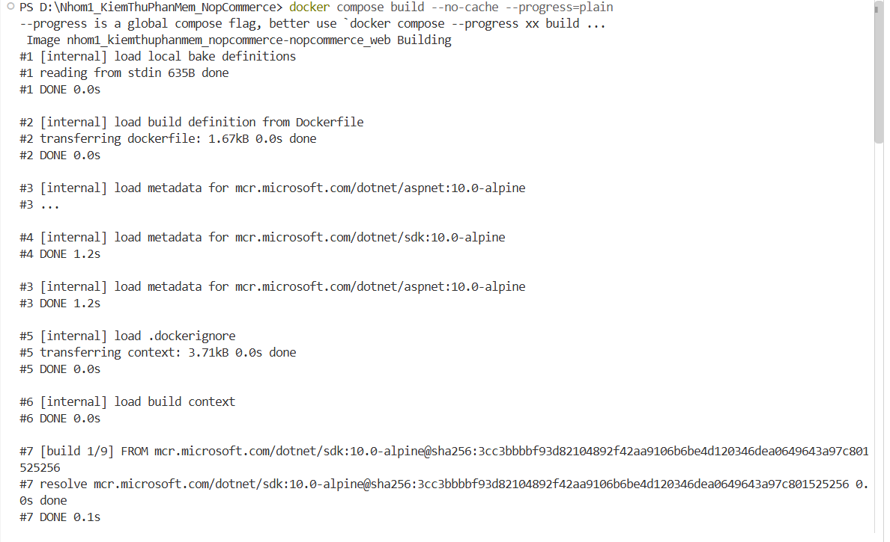
- [x] SQL Server ready; trang cài đặt nopCommerce trả HTTP 200.
[Khoa]
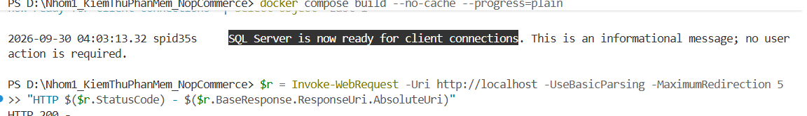
- [x] Hoàn tất installer, database kết nối và storefront trả HTTP 200 sau khi web container được khởi động lại.
[Khoa]
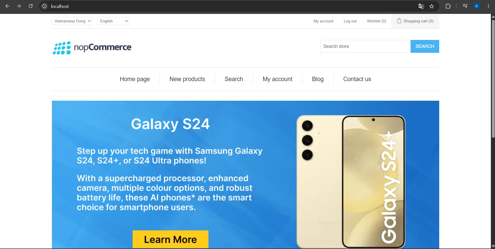
[Linh]
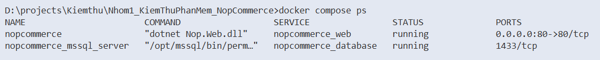
- [x] Đăng nhập Admin và tạo được fixture sản phẩm.
[Khoa]
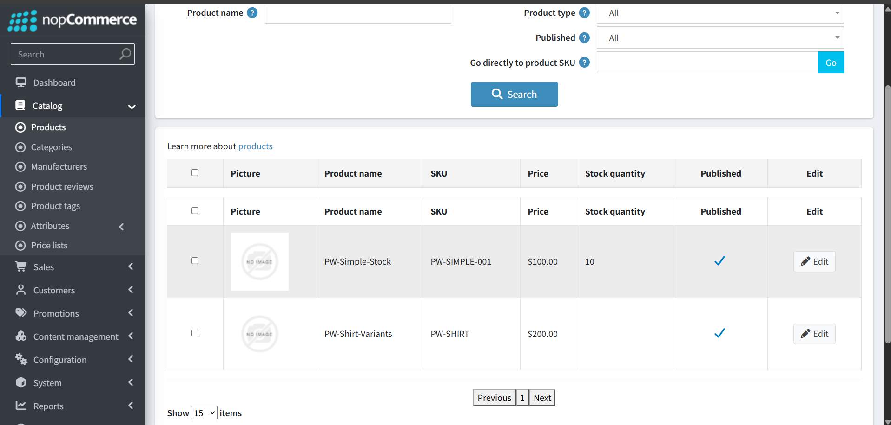
- [x] Có sản phẩm thường và sản phẩm biến thể; bốn tổ hợp tồn kho đã được tạo.
[Khoa]
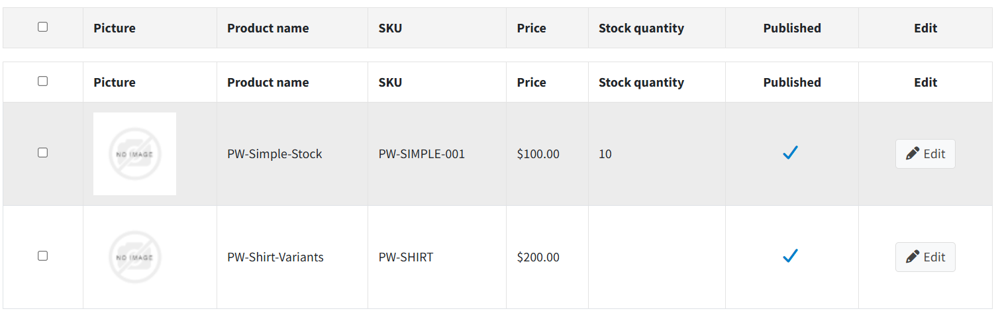
- [x] Storefront từ chối Red/S quantity `6` khi tồn kho là `5`.
[Khoa]
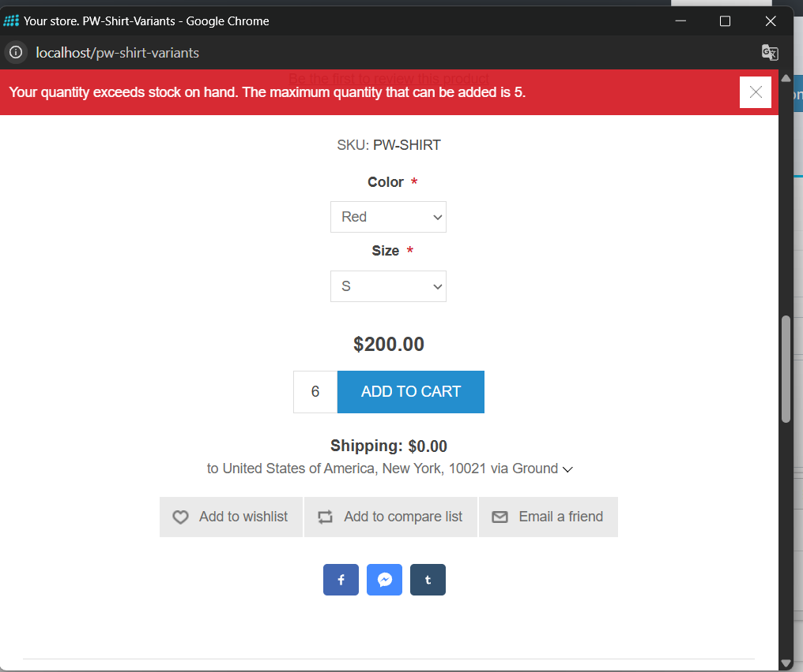
- [x] Storefront chấp nhận ca hợp lệ Red/S quantity `5`; lưu ảnh kết quả.
[Khoa]
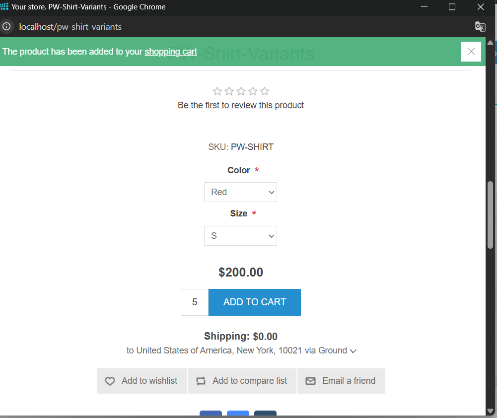
- [x] Customer test đăng nhập được.
[Khoa]
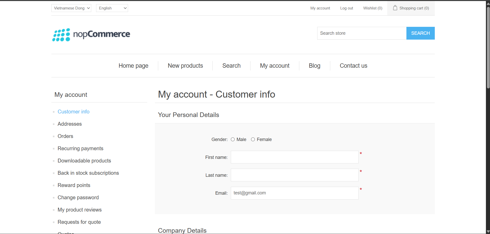
- [x] Trang chạy lại theo hướng dẫn từ đúng SHA `674d0ceef6bd8a52fe74d6f4fff326960162cec0`; 30/09/2026; kết quả: đạt. Môi trường kiểm chứng: .NET SDK `10.0.401`, Docker Engine `29.7.2`, Docker Compose `v5.5.1`, storefront `http://localhost/`.

  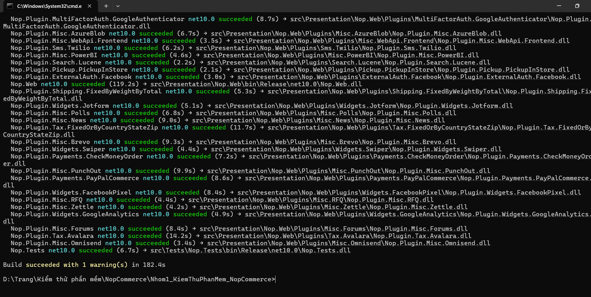
  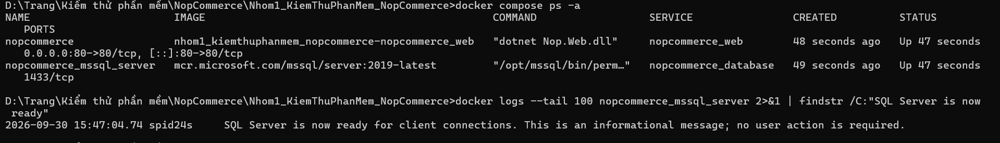
  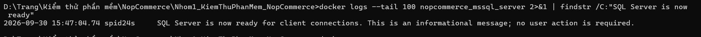
  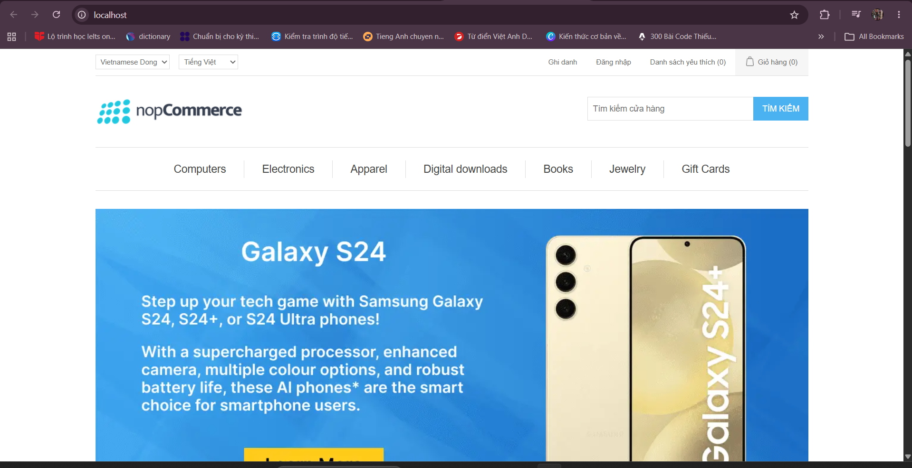
  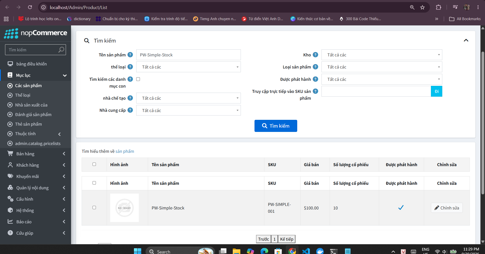
  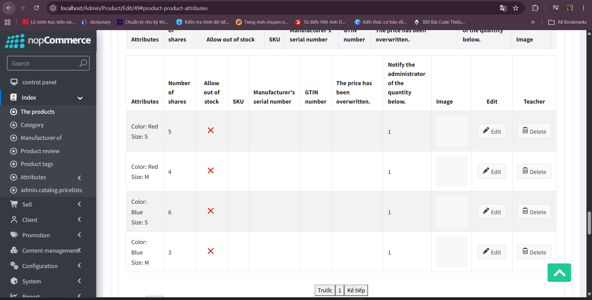
  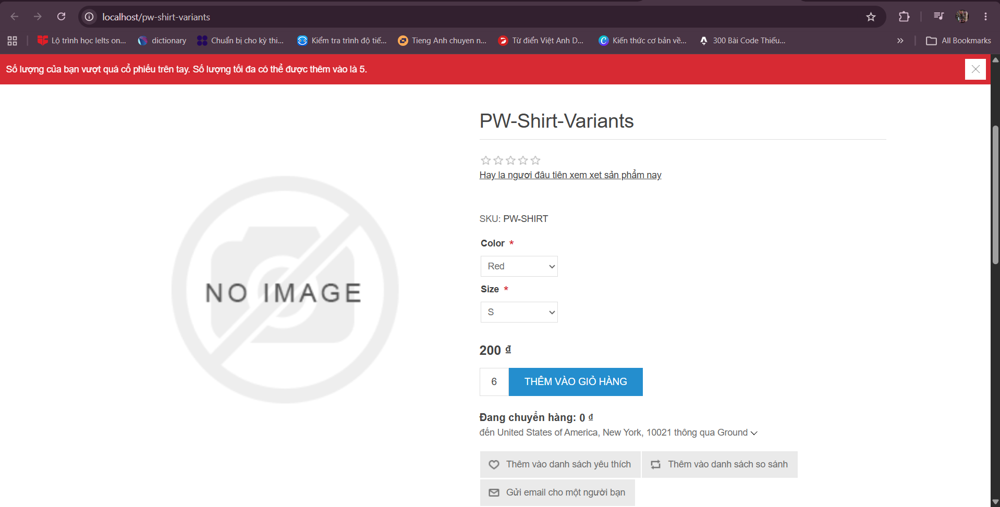
  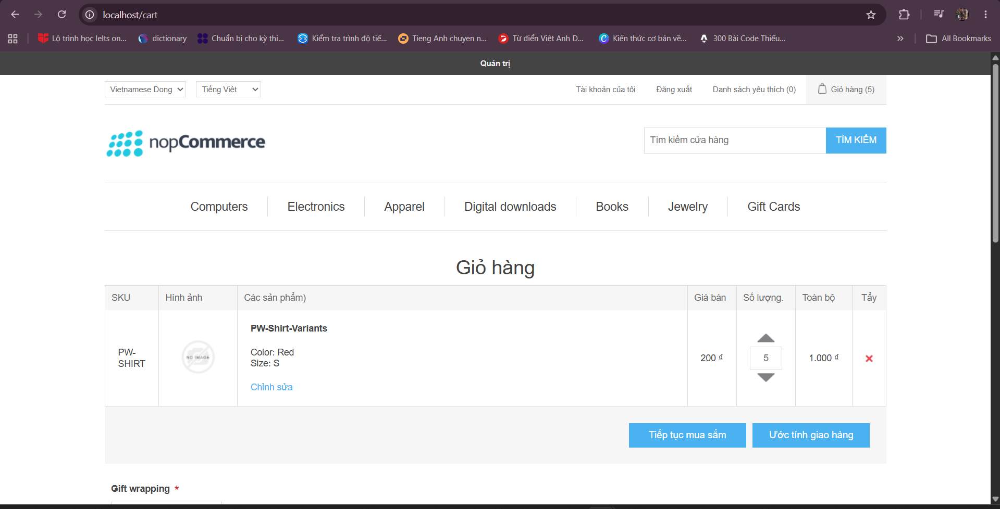
  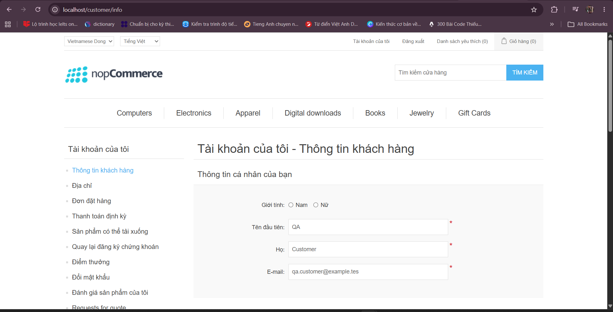
- [x] Linh chạy lại theo hướng dẫn từ đúng SHA; 30/09/2026; kết quả:đạt

Các ô chưa đánh dấu là việc còn lại; không đánh dấu thay cho bằng chứng chạy thực tế.
